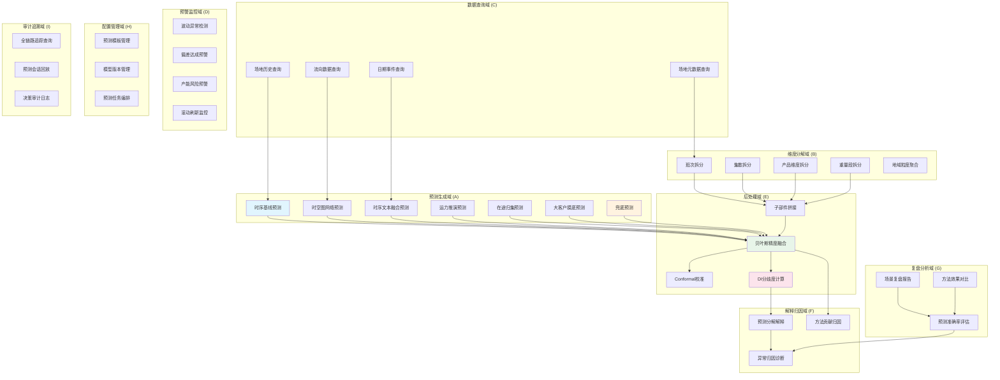
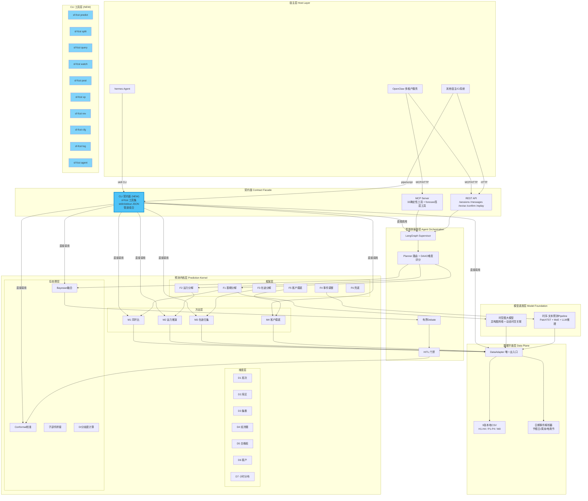

# 顺丰预测智能体 CLI 化架构重构方案 v2.0

> **文档定位**：面向技术决策者与核心开发者的架构重构设计文档
> **作者**：架构师 Bob（高见远）
> **日期**：2026-06-16
> **上游输入**：顺丰预测智能体架构 v1.0 + 02-总体方案与技术架构 v4.0 + 01-产品需求与业务背景 v4.0
> **决策层级**：战略级架构重构提案

---

## 目录

- [第一部分：原子能力提炼](#第一部分原子能力提炼)
- [第二部分：CLI 切入点分析](#第二部分cli-切入点分析)
- [第三部分：CLI 化架构重构方案](#第三部分cli-化架构重构方案)
- [第四部分：落地路线图](#第四部分落地路线图)

---

# 第一部分：原子能力提炼

## 1.0 方法论说明

原子能力（Atomic Capability）的定义标准：

| 标准 | 说明 |
|------|------|
| **不可再分** | 拆分后失去独立业务含义 |
| **独立可复用** | 不依赖特定上下文即可被调用 |
| **输入输出明确** | 有清晰的接口契约（input → output） |
| **单一职责** | 只做一件事，做好一件事（Unix 哲学） |
| **可组合** | 多个原子能力可编排为复合能力 |

提炼过程从功能视角出发，**不局限于当前四层分层**，而是穿透式拆解，最终按**能力域**重新分组。

## 1.1 能力域总览

```
                        ┌──────────────────────┐
                        │    预测智能体系统      │
                        └──────────────────────┘
                                     │
        ┌────────┬────────┬────────┬─┴─────────┬────────┬────────┬────────┐
        ▼        ▼        ▼        ▼           ▼        ▼        ▼        ▼
    预测生成域 维度分解域 数据查询域 预警监控域  后处理域 解释归因域 复盘分析域 配置管理域 审计追溯域
     (7项)     (5项)     (4项)     (4项)       (4项)    (3项)     (3项)     (3项)     (3项)
```

## 1.2 原子能力详表

### 域A：预测生成域（Prediction Generation）

核心职责：基于不同数据源和方法论，生成件量预测值。

| ID | 原子能力 | 输入 | 输出 | 一句话描述 |
|----|---------|------|------|-----------|
| **A01** | 时序基线预测 | 场地代码 + 目标日期 + 时间窗口(L/S/D) + 历史数据源 | `ForecastClaim{mean, p10, p90, confidence}` | 基于历史时序同环比生成基线预测值 |
| **A02** | 时空图网络预测 | 场地/流向代码 + 目标日期 + 图网络模型版本 | `ForecastClaim{mean, p10, p90, confidence}` + 节点嵌入 | 使用异构图网络对中转/流向进行网络级预测 |
| **A03** | 时序文本融合预测 | 场地代码 + 目标日期 + 品类 + 事件描述(可选) | `ForecastClaim{mean, p10, p90, confidence}` + 事件编码 | 基于PatchTST+MoE+LLM的多品类统一预测 |
| **A04** | 运力推演预测 | 场地代码 + 目标日期 + 规划运力数据(P1) + 车型 | `ForecastClaim{mean, p10, p90}` + 运力利用率 | 从规划运力推算预期件量（M2） |
| **A05** | 在途归集预测 | 场地代码 + 目标日期 + 在途车辆数据(P4) | `ForecastClaim{mean, p10, p90}` + 在途明细 | 汇总ETA为目标日的在途车辆件量（M3） |
| **A06** | 大客户摸底预测 | 场地代码 + 目标日期 + 客户上报值 + 历史偏差 | `ForecastClaim{mean, p10, p90}` + 偏差修正系数 | 基于客户摸底值+历史偏差修正生成预测（M4） |
| **A07** | 兜底预测 | 场地代码 + 目标日期 + 历史中位数 | `ForecastClaim{mean}` + degraded_flag | 当其他方法不可用时返回历史中位数兜底值（F6_兜底） |

### 域B：维度分解域（Dimension Decomposition）

核心职责：将总量预测按业务维度拆分为子部件。

| ID | 原子能力 | 输入 | 输出 | 一句话描述 |
|----|---------|------|------|-----------|
| **B01** | 班次拆分 | 总预测量 + 场地代码 + 历史班次占比 | `{shift: ratio}[]` | 按作业班次（白班/晚班/通宵）拆分预测 |
| **B02** | 集散拆分 | 总预测量 + 场地代码 + 收件/派件占比数据 | `{collect: N, distribute: M}` | 按集货/散货维度拆分预测（D3） |
| **B03** | 产品维度拆分 | 总预测量 + 收入产品类型 | `{product_type: value}[]` | 按收入产品类型拆分预测 |
| **B04** | 重量段拆分 | 总预测量 + 重量区间定义 + 历史分布 | `{weight_band: value}[]` | 按重量区间拆分预测 |
| **B05** | 地域粒度聚合 | 多场地/多层级预测数据 + 聚合维度 | `{level: ForecastClaim}[]` (L1-L4) | 按全网→业务区→城市/网点→AOI四级粒度聚合/下钻 |

### 域C：数据查询域（Data Query）

核心职责：提供对底层数据平面的标准化查询能力。

| ID | 原子能力 | 输入 | 输出 | 一句话描述 |
|----|---------|------|------|-----------|
| **C01** | 场地历史查询 | 场地代码 + 时间范围 + 指标类型 | `TimeSeries{timestamps[], values[]}` | 查询指定场地的历史件量时序数据 |
| **C02** | 流向数据查询 | 出发地 + 目的地 + 时间范围 + 运输方式 | `FlowMatrix{from, to, volume}[]` | 查询省-省/城-城流向的历史与预测数据 |
| **C03** | 日期事件查询 | 日期 + 场地范围 | `EventList{type, impact_score, description}[]` | 查询指定日期的节假日/电商节/天气等事件标签 |
| **C04** | 场地元数据查询 | 场地代码 | `SiteMeta{code, name, type, dept, capacity…}` | 查询场地的静态元数据与运营属性映射 |

### 域D：预警监控域（Alert & Monitoring）

核心职责：持续监控预测质量与业务风险。

| ID | 原子能力 | 输入 | 输出 | 一句话描述 |
|----|---------|------|------|-----------|
| **D01** | 波动异常检测 | 场地代码 + 监控指标 + 阈值配置 | `Alert{type, severity, metric, current, baseline, deviation}` | 检测收件/到件/流向的统计异常波动 |
| **D02** | 偏差达成预警 | 场地代码 + 预测值 + 实际值 + 偏差阈值 | `DeviationAlert{predicted, actual, delta, severity}` | 预测vs实际偏差超过阈值时触发预警 |
| **D03** | 产能风险预警 | 场地代码 + 预测量 + 产能上限 | `CapacityAlert{site, forecast, capacity, utilization%}` | 预测量接近或超过产能上限时触发预警 |
| **D04** | 滚动刷新监控 | 场地代码集合 + 刷新频率 + DI阈值 | `RefreshReport{site, changed, delta_since_last}[]` | 按设定频率重算预测并标记显著变化的场地 |

### 域E：后处理域（Post-Processing）

核心职责：对多方法预测结果进行融合、校准与拼接。

| ID | 原子能力 | 输入 | 输出 | 一句话描述 |
|----|---------|------|------|-----------|
| **E01** | 贝叶斯精度融合 | `ForecastClaim[]` (多方法) + 历史MAPE | `ForecastClaim{mean, p10, p90, confidence}` | 基于各方法历史精度进行贝叶斯加权融合 |
| **E02** | Conformal校准 | `ForecastClaim` + 历史残差分布(分桶) | `ForecastClaim{mean, p10, p90}` (校准后) | 按场地类型×事件×horizon分桶进行共形校准 |
| **E03** | 子部件拼接 | `ForecastClaim[]` (F1-F6子部件) + 拼接规则 | `ForecastClaim{mean, p10, p90}` + 分解明细 | 将框架分解后的子部件预测拼接为总预测 |
| **E04** | DI分歧度计算 | `ForecastClaim[]` (多方法) | `DisagreementIndex{di, level, detail}` | 计算多方法预测间的分歧度指数(DI) |

### 域F：解释归因域（Explain & Attribute）

核心职责：对预测结果提供可解释的归因分析。

| ID | 原子能力 | 输入 | 输出 | 一句话描述 |
|----|---------|------|------|-----------|
| **F01** | 预测分解解释 | `ForecastClaim` + 子部件明细 + 事件编码 | `Decomposition{baseline, events[], capacity, spatial, residual}` | 将预测值分解为基期+事件+运力+空间+残差 |
| **F02** | 方法贡献归因 | `ForecastClaim` + 融合权重 + 各方法预测 | `Attribution{method: contribution%}[]` | 量化各方法对最终融合预测的贡献度 |
| **F03** | 异常归因诊断 | 实际值 + 预测值 + 事件数据 + 运营数据 | `Diagnosis{causes[], confidence, recommendations[]}` | 偏差根因分析，识别数据/事件/运营异常因子 |

### 域G：复盘分析域（Review & Retrospective）

核心职责：对历史预测进行系统性评估。

| ID | 原子能力 | 输入 | 输出 | 一句话描述 |
|----|---------|------|------|-----------|
| **G01** | 预测准确率评估 | 场地代码 + 时间范围 + 评估指标(MAPE/wMAPE等) | `AccuracyReport{mape, wmape, rmse, hit_rate}[]` | 计算指定场景下预测准确率的各项统计指标 |
| **G02** | 场景复盘报告 | 场景类型 + 时间范围 + 复盘维度 | `ReviewReport{summary, insights, action_items}[]` | 按场景(高峰/中转/航空/特经等)生成结构化复盘报告 |
| **G03** | 方法效果对比 | 场地代码 + 时间范围 + 方法列表 | `ComparisonReport{method: metrics}[]` | 对比不同预测方法在同一场景下的效果差异 |

### 域H：配置管理域（Configuration Management）

核心职责：管理预测系统的配置与模型生命周期。

| ID | 原子能力 | 输入 | 输出 | 一句话描述 |
|----|---------|------|------|-----------|
| **H01** | 预测模板管理 | 模板ID + 模板定义(F×M×D×基期) | `Template{id, spec, version}` | 15套方案模板的创建/查询/更新/版本化 |
| **H02** | 模型版本管理 | 模型名称 + 版本 + 模型文件/配置 | `ModelVersion{name, version, status, metrics}` | 大模型版本登记、切换、回滚与效果追踪 |
| **H03** | 预测任务编排 | 任务定义(场地列表+参数+调度) + 优先级 | `TaskRun{id, status, progress, result}` | 批量预测任务的创建、调度与执行追踪 |

### 域I：审计追溯域（Audit & Traceability）

核心职责：保证全链路可追溯、可回放。

| ID | 原子能力 | 输入 | 输出 | 一句话描述 |
|----|---------|------|------|-----------|
| **I01** | 全链路追踪查询 | trace_id | `TraceTree{nodes[], edges[], timings}` | 按trace_id查询一次预测的完整调用链路 |
| **I02** | 预测会话回放 | session_id + 时间点 | `ReplaySequence{steps[], states[]}` | 回放指定会话在指定时间的所有预测步骤与状态 |
| **I03** | 决策审计日志 | 时间范围 + 操作类型 + 用户 | `AuditLog{timestamp, actor, action, before, after}[]` | 查询HITL人工修正/配置变更等关键决策的完整审计记录 |

## 1.3 能力域关系图



---

# 第二部分：CLI 切入点分析

## 2.1 CLI 适配性判断框架

并非所有原子能力都适合封装为 CLI。我们建立五维度判断标准：

| 维度 | CLI 友好 | 非 CLI 友好 |
|------|---------|-------------|
| **交互模式** | 单次请求-响应，非交互式 | 多轮对话、需要上下文保持 |
| **输入特征** | 结构化参数（flags/args/stdin JSON） | 自然语言自由文本、模糊意图 |
| **输出特征** | 结构化、可管道（JSON/CSV/table） | 富文本、图表、实时流式更新 |
| **执行特征** | 确定性计算、可复现、无副作用 | 依赖LLM推理、概率性、有副作用 |
| **使用场景** | 脚本化、自动化、CI/CD、批量处理 | 人工交互、探索式分析、实时决策 |

### CLI 黄金公式

```
CLI 适配度 = f(输入结构化程度, 输出标准化程度, 执行确定性, 非交互性, 可组合性)
```

**高度适合 CLI**：五维度得分均高 → 封装为独立子命令
**中度适合 CLI**：3-4 维度得分高 → 封装但提供 `--json` / `--table` 双模式
**不适合 CLI**：≤2 维度得分高 → 保留在智能体层/服务层，CLI 仅提供调用入口

## 2.2 逐项评估矩阵

### 预测生成域 (A)

| ID | 能力 | CLI适配性 | 判断 | 建议 |
|----|------|:---:|------|------|
| A01 | 时序基线预测 | ⭐⭐⭐⭐⭐ | 输入完全结构化(场地+日期+窗口)、输出为 ForecastClaim JSON、确定性计算、可脚本化批量执行 | **核心 CLI 命令** |
| A02 | 时空图网络预测 | ⭐⭐⭐⭐ | 输入结构化、确定性推理(非LLM)、但需GPU资源、单次执行较重 | CLI 命令，标注资源需求 |
| A03 | 时序文本融合预测 | ⭐⭐⭐ | 输入含事件描述(半结构化)、LLM参与推理、存在概率性 | CLI 命令，但归属 `agent` 子命令组 |
| A04 | 运力推演预测 | ⭐⭐⭐⭐⭐ | 纯确定性公式(M2)、结构化输入输出、高度可复现 | **核心 CLI 命令** |
| A05 | 在途归集预测 | ⭐⭐⭐⭐⭐ | 纯确定性汇总(M3)、结构化输入输出 | **核心 CLI 命令** |
| A06 | 大客户摸底预测 | ⭐⭐⭐⭐ | 确定性计算为主、但依赖外部摸底值输入(人工) | CLI 命令，`--customer-input` 参数 |
| A07 | 兜底预测 | ⭐⭐⭐⭐⭐ | 最简单的确定性计算、无外部依赖 | **核心 CLI 命令** |

### 维度分解域 (B)

| ID | 能力 | CLI适配性 | 判断 | 建议 |
|----|------|:---:|------|------|
| B01 | 班次拆分 | ⭐⭐⭐⭐⭐ | 纯比例计算、结构化输入输出、可管道 | **核心 CLI 命令** |
| B02 | 集散拆分 | ⭐⭐⭐⭐⭐ | 纯计算逻辑、结构化、确定性 | **核心 CLI 命令** |
| B03 | 产品维度拆分 | ⭐⭐⭐⭐ | 结构化、确定性，但依赖产品维度映射配置 | CLI 命令 |
| B04 | 重量段拆分 | ⭐⭐⭐⭐ | 同上 | CLI 命令 |
| B05 | 地域粒度聚合 | ⭐⭐⭐⭐⭐ | 纯聚合计算、结构化、支持管道多输入 | **核心 CLI 命令** |

### 数据查询域 (C)

| ID | 能力 | CLI适配性 | 判断 | 建议 |
|----|------|:---:|------|------|
| C01 | 场地历史查询 | ⭐⭐⭐⭐⭐ | 典型的数据查询、结构化输入输出、管道友好 | **核心 CLI 命令** |
| C02 | 流向数据查询 | ⭐⭐⭐⭐⭐ | 同上 | **核心 CLI 命令** |
| C03 | 日期事件查询 | ⭐⭐⭐⭐⭐ | 确定性查询、结构化输出 | **核心 CLI 命令** |
| C04 | 场地元数据查询 | ⭐⭐⭐⭐⭐ | 最简单查询、可做其他命令的前置依赖 | **核心 CLI 命令** |

### 预警监控域 (D)

| ID | 能力 | CLI适配性 | 判断 | 建议 |
|----|------|:---:|------|------|
| D01 | 波动异常检测 | ⭐⭐⭐⭐ | 确定性统计算法、结构化输入、但持续运行需 Cron 包装 | CLI 命令 + Cron 集成指南 |
| D02 | 偏差达成预警 | ⭐⭐⭐⭐ | 同上、纯数值比较、输出结构化告警 | CLI 命令 + Cron 集成指南 |
| D03 | 产能风险预警 | ⭐⭐⭐⭐ | 同上 | CLI 命令 + Cron 集成指南 |
| D04 | 滚动刷新监控 | ⭐⭐⭐ | 需要连续性执行、建议用 Cron 调用 CLI + 外部调度 | CLI 命令 + 外部调度器 |

### 后处理域 (E)

| ID | 能力 | CLI适配性 | 判断 | 建议 |
|----|------|:---:|------|------|
| E01 | 贝叶斯精度融合 | ⭐⭐⭐⭐⭐ | 纯数学计算、结构化多输入→单输出、管道核心环节 | **核心 CLI 命令** |
| E02 | Conformal校准 | ⭐⭐⭐⭐⭐ | 纯统计计算、确定性、管道友好 | **核心 CLI 命令** |
| E03 | 子部件拼接 | ⭐⭐⭐⭐⭐ | 纯组合计算、管道友好 | **核心 CLI 命令** |
| E04 | DI分歧度计算 | ⭐⭐⭐⭐⭐ | 纯统计计算、单值输出、管道友好 | **核心 CLI 命令** |

### 解释归因域 (F)

| ID | 能力 | CLI适配性 | 判断 | 建议 |
|----|------|:---:|------|------|
| F01 | 预测分解解释 | ⭐⭐⭐⭐ | 结构化输出、但部分依赖LLM做文字解释 | CLI `--format json|text` 双模式 |
| F02 | 方法贡献归因 | ⭐⭐⭐⭐⭐ | 纯数值计算、可直接从融合权重推导 | **核心 CLI 命令** |
| F03 | 异常归因诊断 | ⭐⭐⭐ | 需要LLM推理+多数据源关联、部分依赖自然语言 | CLI 提供数据聚合，归因文本走 agent 子命令 |

### 复盘分析域 (G)

| ID | 能力 | CLI适配性 | 判断 | 建议 |
|----|------|:---:|------|------|
| G01 | 预测准确率评估 | ⭐⭐⭐⭐⭐ | 纯统计计算、批量处理、适合脚本化 | **核心 CLI 命令** |
| G02 | 场景复盘报告 | ⭐⭐⭐ | 需要LLM生成文字分析、人工解读 | CLI 提供数据骨架，文字经 agent 生成 |
| G03 | 方法效果对比 | ⭐⭐⭐⭐⭐ | 纯统计对比、表格化输出 | **核心 CLI 命令** |

### 配置管理域 (H)

| ID | 能力 | CLI适配性 | 判断 | 建议 |
|----|------|:---:|------|------|
| H01 | 预测模板管理 | ⭐⭐⭐⭐⭐ | 典型CRUD、结构化、适合CLI | **核心 CLI 命令** |
| H02 | 模型版本管理 | ⭐⭐⭐⭐ | 结构化CRUD、但涉及大文件/权重操作 | CLI 命令，大文件路径引用 |
| H03 | 预测任务编排 | ⭐⭐⭐⭐ | 批量操作适合CLI、但长期运行需守护 | CLI 触发 + 异步执行 |

### 审计追溯域 (I)

| ID | 能力 | CLI适配性 | 判断 | 建议 |
|----|------|:---:|------|------|
| I01 | 全链路追踪查询 | ⭐⭐⭐⭐⭐ | 确定性查询、结构化输出、适合调试 | **核心 CLI 命令** |
| I02 | 预测会话回放 | ⭐⭐⭐⭐ | 结构化输出、适合调试/审计 | CLI 命令，`--format json|tree` |
| I03 | 决策审计日志 | ⭐⭐⭐⭐⭐ | 确定性查询、结构化输出、合规场景 | **核心 CLI 命令** |

## 2.3 CLI 能力矩阵总结

```
总计 36 项原子能力
├── ⭐⭐⭐⭐⭐ 核心 CLI (25项)  → 独立子命令，管道一级公民
├── ⭐⭐⭐⭐  CLI 适用 (7项)    → 独立子命令，标注依赖
├── ⭐⭐⭐   部分适用 (4项)    → 归入 agent 子命令组或提供数据接口
└── ⭐⭐     不适合 (0项)     → 保留在服务层
```

### CLI 典型使用场景与用户角色

| 场景 | 用户角色 | 典型命令示例 |
|------|---------|-------------|
| **批量场地预测** | IE工程师/调度员 | `sf-fcst predict run --sites-file sites.csv --date 2026-06-17 \| sf-fcst post fuse \| jq` |
| **预测质量巡检** | 算法工程师 | `sf-fcst rev mape --site 021WD --days 30 --format table` |
| **异常排查** | 运维/值班员 | `sf-fcst watch anomaly --site 021WD --threshold 2.5` |
| **数据探查** | 数据分析师 | `sf-fcst query site 021WD --from 2026-06-01 --to 2026-06-15 \| sf-fcst split shift` |
| **预测回放调试** | 开发者 | `sf-fcst log trace --id abc123 \| jq '.nodes[] \| select(.duration_ms > 1000)'` |
| **CI/CD 回归测试** | 测试/DevOps | `sf-fcst predict baseline --site 021WD --date 2026-01-15 \| sf-fcst rev mape --anchor 162930` |
| **大客户预警** | 业务经理 | `sf-fcst watch deviation --site 512WE --type customer --threshold 0.3` |
| **模板批量管理** | 系统管理员 | `sf-fcst cfg template list --framework F1 \| sf-fcst cfg template export` |

---

# 第三部分：CLI 化架构重构方案

## 3.1 重构后总体架构



## 3.2 CLI 层与现有四层的关系

```
                     ┌─────────────────────────────────────────────┐
   v1.0 四层          │           v2.0 CLI 化重构后                  │
                     │                                             │
  ┌─────────────┐    │  ┌─────────────┐                            │
  │ 业务应用层   │    │  │  宿主层      │  ← OpenClaw/hermes/CI     │
  ├─────────────┤    │  ├─────────────┤                            │
  │ 智能体层     │    │  │  CLI 契约层  │  ← ★ NEW: sf-fcst        │
  ├─────────────┤    │  ├─────────────┤                            │
  │ 预测服务层   │    │  │ 智能体编排层 │  ← LangGraph Supervisor   │
  ├─────────────┤    │  ├─────────────┤                            │
  │ 预测大模型层 │    │  │  预测内核层  │  ← F×M×D + 后处理         │
  └─────────────┘    │  ├─────────────┤                            │
                     │  │  模型底座层  │  ← 时空图 + 时序文本       │
                     │  ├─────────────┤                            │
                     │  │  数据平面层  │  ← DataAdapter + CSV       │
                     │  └─────────────┘                            │
                     └─────────────────────────────────────────────┘
```

**核心变化**：
1. **业务应用层消解**：原"面客"和"丰测"中的交互/看板归宿主层，其余功能映射为 CLI 命令或智能体编排
2. **智能体层分化**：LLM 密集型（对话/分析/复盘）留在编排层，确定性能力下沉到内核层
3. **预测服务层 + 大模型层合并重构**：拆分为"预测内核层"和"模型底座层"，使内核可脱离模型独立运行
4. **CLI 契约层新增**：作为与 hermes CLI、MCP/REST 平行的第三契约面，面向开发者和自动化场景

### 解耦设计关键原则

```
CLI ──直接调用──▶ 预测内核层 (纯函数，零 LLM 依赖)
CLI ──间接调用──▶ 智能体编排层 (仅 agent 子命令组)
CLI ──零依赖────▶ 宿主层 (CLI 不关心谁在调用它)

CLI 输入:  stdin JSON / CLI args / env vars
CLI 输出:  stdout JSON / stderr logs / exit code
CLI 配置:  ~/.sf-fcst/config.yaml / --config 覆盖
```

## 3.3 CLI 命令树设计

```
sf-fcst
│
├── predict                          # 预测生成
│   ├── run                         # 统一预测入口（自动选法）
│   │   └── [--site] [--date] [--window L|S|D]
│   │       [--framework F1-F6] [--method M1-M4]
│   │       [--tenant] [--output json|table]
│   ├── baseline                    # 纯时序基线预测 (A01)
│   │   └── --site --date [--method m1a|m1b|m1c|m1d|m1e]
│   ├── stgraph                     # 时空图预测 (A02)
│   │   └── --site --date [--model-version]
│   ├── ttp                         # 时序文本融合预测 (A03)
│   │   └── --site --date [--category] [--event-desc]
│   ├── transport                   # 运力推演 (A04)
│   │   └── --site --date [--vehicle-type]
│   ├── intransit                   # 在途归集 (A05)
│   │   └── --site --date
│   ├── customer                    # 大客户摸底 (A06)
│   │   └── --site --date --customer-input <JSON>
│   └── fallback                    # 兜底预测 (A07)
│       └── --site --date
│
├── split                           # 维度分解
│   ├── shift                       # 班次拆分 (B01)
│   │   └── [--value <N>] [--site] [--stdin]
│   ├── cd                          # 集散拆分 (B02)
│   │   └── [--value <N>] [--site] [--stdin]
│   ├── product                     # 产品维度 (B03)
│   │   └── [--value <N>] [--site] [--stdin]
│   ├── weight                      # 重量段 (B04)
│   │   └── [--value <N>] [--site] [--stdin]
│   └── aggregate                   # 地域粒度聚合/下钻 (B05)
│       └── [--level L1|L2|L3|L4] [--stdin]
│
├── query                           # 数据查询
│   ├── site                        # 场地历史查询 (C01)
│   │   └── --site [--from] [--to] [--metric]
│   ├── flow                        # 流向数据查询 (C02)
│   │   └── --from-site --to-site [--from-date] [--to-date]
│   ├── events                      # 日期事件查询 (C03)
│   │   └── --date [--site-scope]
│   └── meta                        # 场地元数据 (C04)
│       └── --site [--format json|table]
│
├── watch                           # 预警监控
│   ├── anomaly                     # 波动异常检测 (D01)
│   │   └── --site [--metric] [--threshold] [--window]
│   ├── deviation                   # 偏差达成预警 (D02)
│   │   └── --site --predicted --actual [--threshold]
│   ├── capacity                    # 产能风险预警 (D03)
│   │   └── --site [--capacity-limit] [--date]
│   └── refresh                     # 滚动刷新 (D04)
│       └── --sites-file [--interval] [--di-threshold]
│
├── post                            # 后处理
│   ├── fuse                        # Bayesian融合 (E01)
│   │   └── --claims-file <JSON> | --stdin
│   ├── cal                         # Conformal校准 (E02)
│   │   └── --claim <JSON> --site-type [--horizon]
│   ├── stitch                      # 子部件拼接 (E03)
│   │   └── --parts-file <JSON> | --stdin
│   └── di                          # DI分歧度计算 (E04)
│       └── --claims-file <JSON> | --stdin
│
├── xp                              # 解释归因
│   ├── why                         # 预测分解解释 (F01)
│   │   └── --claim <JSON> [--format json|text]
│   ├── attr                        # 方法贡献归因 (F02)
│   │   └── --fuse-result <JSON>
│   └── diagnose                    # 异常归因诊断 (F03)
│       └── --actual --predicted [--events] [--format json|text]
│
├── rev                             # 复盘分析
│   ├── mape                        # 准确率评估 (G01)
│   │   └── --site [--from] [--to] [--metric mape|wmape|rmse]
│   ├── report                      # 场景复盘报告 (G02)
│   │   └── --scene [--from] [--to] [--format json|text]
│   └── compare                     # 方法效果对比 (G03)
│       └── --site [--from] [--to] --methods M1,M2,M3
│
├── cfg                             # 配置管理
│   ├── template                    # 模板管理 (H01)
│   │   ├── list [--framework] [--format table|json]
│   │   ├── show --id
│   │   ├── create --spec <JSON>
│   │   ├── update --id --spec <JSON>
│   │   └── delete --id
│   ├── model                       # 模型版本管理 (H02)
│   │   ├── list [--status active|all]
│   │   ├── show --name --version
│   │   ├── register --name --version --path
│   │   └── promote --name --version
│   └── pipeline                    # 任务编排 (H03)
│       ├── submit --task-def <JSON>
│       ├── status --task-id
│       └── cancel --task-id
│
├── log                             # 审计追溯
│   ├── trace                       # 链路追踪查询 (I01)
│   │   └── --trace-id [--format json|tree]
│   ├── replay                      # 会话回放 (I02)
│   │   └── --session-id [--step]
│   └── audit                       # 决策审计日志 (I03)
│       └── [--from] [--to] [--actor] [--action-type]
│
├── agent                           # 智能体对话入口
│   ├── chat                        # 对话式预测（NL输入）
│   │   └── "明天021WD到件量" [--interactive]
│   ├── analyze                     # AI摸底分析
│   │   └── --site --date [--scene]
│   └── review                      # AI复盘
│       └ --site --scene [--from] [--to]
│
├── --version                       # 版本信息
├── --help                          # 帮助信息
└── --config                        # 配置文件路径
```

## 3.4 输入输出契约（JSON Schema）

### 通用输出信封

所有 CLI 命令的输出遵循统一信封格式：

```json
{
  "$schema": "https://sf-forecast.io/schemas/cli-output-v1.json",
  "type": "object",
  "required": ["status", "data"],
  "properties": {
    "status": {
      "type": "string",
      "enum": ["ok", "error", "degraded"],
      "description": "ok=正常, error=失败, degraded=降级输出(如只用了兜底)"
    },
    "data": {
      "description": "命令特定的输出数据，类型随命令变化"
    },
    "meta": {
      "type": "object",
      "properties": {
        "command": { "type": "string" },
        "duration_ms": { "type": "number" },
        "trace_id": { "type": "string" },
        "tenant": { "type": "string" },
        "degraded_reason": { "type": "string" }
      }
    },
    "error": {
      "type": "object",
      "properties": {
        "code": { "type": "string" },
        "message": { "type": "string" },
        "details": { "type": "object" }
      }
    }
  }
}
```

### 核心数据类型

#### ForecastClaim（统一预测主张）

```json
{
  "$id": "ForecastClaim",
  "type": "object",
  "required": ["mean", "confidence", "method"],
  "properties": {
    "mean": { "type": "number", "description": "预测均值(件)" },
    "p10": { "type": "number", "description": "10%分位数" },
    "p90": { "type": "number", "description": "90%分位数" },
    "confidence": { "type": "number", "minimum": 0, "maximum": 1 },
    "method": { "type": "string", "enum": ["M1", "M2", "M3", "M4", "STG", "TTP", "F6_FALLBACK", "FUSION"] },
    "decomposition": { "$ref": "#/Decomposition" },
    "evidence_refs": { "type": "array", "items": { "type": "string" } },
    "assumptions": { "type": "array", "items": { "type": "string" } },
    "risk_flags": { "type": "array", "items": { "type": "string" } }
  }
}
```

#### DisagreementIndex（分歧度）

```json
{
  "$id": "DisagreementIndex",
  "type": "object",
  "required": ["di", "level"],
  "properties": {
    "di": { "type": "number", "description": "分歧度指数 0-1" },
    "level": { "type": "string", "enum": ["low", "medium", "high", "critical"] },
    "action": { "type": "string", "enum": ["fuse_directly", "weighted_vote", "bounded_debate", "hitl_required"] },
    "detail": {
      "type": "object",
      "properties": {
        "std": { "type": "number" },
        "mean_of_means": { "type": "number" },
        "n_methods": { "type": "integer" },
        "outlier_methods": { "type": "array", "items": { "type": "string" } }
      }
    }
  }
}
```

### 管道组合示例

```bash
# 示例1: 管道串联预测全流程
sf-fcst predict baseline --site 021WD --date 2026-06-17 --method m1a \
  | sf-fcst post cal --site-type transit_center \
  | sf-fcst split shift --stdin \
  | jq '.data'

# 示例2: 批量场地预测 + 融合 + 准确率评估
for site in 021WD 755W 512WE; do
  sf-fcst predict baseline --site $site --date 2026-06-17
done | sf-fcst post fuse --stdin \
     | tee /tmp/prediction.json \
     | sf-fcst rev mape --site 021WD --actual-file /tmp/actuals.csv

# 示例3: 异常检测 + 预警触发
sf-fcst watch anomaly --site 021WD --threshold 2.5 --format json \
  | jq 'select(.data.alerts | length > 0)' \
  | while read alert; do
      sf-fcst xp diagnose --actual $(echo $alert | jq -r '.data.actual') \
                          --predicted $(echo $alert | jq -r '.data.predicted')
    done
```

## 3.5 CLI 解耦设计详解

### 3.5.1 CLI ↔ 预测内核层（直接调用）

```
CLI 命令 ──import──▶ src/kernel/ 纯函数模块
                      ├── frameworks/   (F1-F6)
                      ├── methods/      (M1-M4)
                      ├── dimensions/   (D1-D7)
                      ├── postprocess/  (fusion/calibration/stitch/di)
                      └── data/         (DataAdapter)
```

**解耦保证**：
- CLI 只做参数解析 + 格式化输出，**零业务逻辑**
- 所有计算逻辑在 `src/kernel/` 中以纯函数形式存在
- 内核函数不 import CLI 任何模块
- 内核函数可脱离 CLI 独立单元测试

### 3.5.2 CLI ↔ 智能体编排层（间接调用）

```
CLI agent 子命令 ──import──▶ src/orchestration/
                              ├── graph/      (LangGraph Supervisor)
                              ├── planner/    (Planner路由)
                              ├── debate/     (有界Debate)
                              └── hitl/       (HITL门禁)
```

**隔离策略**：
- 只有 `sf-fcst agent *` 子命令组依赖编排层
- `predict/query/split/post/xp/rev/watch` 全部直接调用内核
- 编排层可独立升级（如从 LangGraph 迁移到其他框架），CLI 无需改动

### 3.5.3 CLI ↔ 模型底座层（零直接依赖）

```
CLI ──(不直接调用)──▶ 模型底座层
                        ├── stgraph/    (时空图大模型)
                        └── tt_pipeline/ (时序文本Pipeline)
```

**隔离理由**：
- 模型底座需要 GPU/大内存，不适合 CLI 直接调用
- CLI 通过内核层的统一接口间接访问模型能力
- `sf-fcst predict stgraph` 和 `sf-fcst predict ttp` 走内核层路由到模型
- 模型不可用时，内核自动降级到非模型方法

### 3.5.4 多环境适配

```yaml
# ~/.sf-fcst/config.yaml
environments:
  dev:
    data_dir: "./test-data/"
    model_endpoint: "http://localhost:8001"
    log_level: "DEBUG"
    checkpoint_dsn: "sqlite:///dev-checkpoints.db"
    
  test:
    data_dir: "/data/sf-forecast/test/"
    model_endpoint: "http://test-model:8001"
    log_level: "INFO"
    checkpoint_dsn: "postgresql://test-db/checkpoints"
    
  prod:
    data_dir: "/data/sf-forecast/prod/"
    model_endpoint: "http://prod-model:8001"
    log_level: "WARNING"
    checkpoint_dsn: "postgresql://prod-db/checkpoints"

# 环境切换
# sf-fcst --env prod predict run --site 021WD --date 2026-06-17
# SF_FCST_ENV=prod sf-fcst predict run ...
```

## 3.6 技术选型建议

| 层次 | 技术 | 理由 |
|------|------|------|
| **CLI 框架** | Python `click` + `rich` | click 是 Python CLI 事实标准，rich 提供美化的 table/markdown 终端渲染 |
| **参数验证** | `pydantic` v2 | 与现有内核的类型系统一致，支持 JSON Schema 导出 |
| **配置管理** | `pydantic-settings` + YAML | 支持环境变量覆盖、多环境配置、.env 文件 |
| **输出格式化** | 内置 JSON + `rich.table` + `rich.markdown` | JSON 为管道默认，table/markdown 为人类可读 |
| **管道支持** | stdin JSON Lines (ndjson) | 多记录流式输入，每行一条 ForecastClaim |
| **日志** | `structlog` | 结构化日志，JSON 输出到 stderr，不污染 stdout 管道 |
| **测试** | `pytest` + `syrupy` (snapshot) + `cram` (CLI集成测试) | syrupy 用于 JSON 输出的快照测试，cram 用于端到端 CLI 测试 |
| **打包** | `pipx` / `pip install` + `pyproject.toml` entry_points | 标准 Python 包分发，`pipx install sf-forecast` 一键安装 |
| **补全** | click 内置 shell completion (bash/zsh/fish) | 零额外依赖，自动生成 |
| **版本管理** | `importlib.metadata` + `--version` | 从 pyproject.toml 读取，CI 注入 git tag |

### 工程目录结构

```
src/
├── kernel/                    # 预测内核（纯函数，零CLI依赖）
│   ├── __init__.py
│   ├── frameworks/            # F1-F6 框架分解
│   ├── methods/               # M1-M4 计算方法
│   ├── dimensions/            # D1-D7 维度拆分
│   ├── postprocess/           # 融合/校准/拼接/DI
│   ├── data/                  # DataAdapter + CSV
│   └── types.py               # ForecastClaim等核心类型
│
├── orchestration/             # 智能体编排（agent子命令依赖）
│   ├── graph/                 # LangGraph Supervisor
│   ├── planner/               # 三维评分 + DAAO
│   ├── debate/                # 有界Debate
│   └── hitl/                  # HITL门禁
│
├── models/                    # 模型底座
│   ├── stgraph/               # 时空图大模型
│   └── tt_pipeline/           # 时序文本Pipeline
│
├── cli/                       # CLI 工具层 ★ NEW
│   ├── __init__.py
│   ├── main.py                # 顶层 sf-fcst 入口
│   ├── predict.py             # predict 命令组
│   ├── split.py               # split 命令组
│   ├── query.py               # query 命令组
│   ├── watch.py               # watch 命令组
│   ├── post.py                # post 命令组
│   ├── xp.py                  # xp 命令组
│   ├── rev.py                 # rev 命令组
│   ├── cfg.py                 # cfg 命令组
│   ├── log_cmd.py             # log 命令组
│   ├── agent.py               # agent 命令组
│   ├── formatters.py          # JSON/table/text 输出格式化
│   ├── validators.py          # pydantic 参数校验模型
│   └── config.py              # CLI 配置管理
│
├── service/                   # REST + MCP 服务（保留）
│   ├── app.py
│   ├── sessions/
│   ├── runner/
│   └── mcp_server.py
│
└── common/                    # 共享工具
    ├── logging.py
    ├── errors.py
    └── ...

tests/
├── cli/                       # CLI 专项测试 ★ NEW
│   ├── test_predict.py
│   ├── test_split.py
│   ├── test_pipeline.py       # 管道集成测试
│   └── snapshots/             # syrupy 快照
├── kernel/                    # 内核测试（保持）
└── integration/               # 端到端测试
    └── test_cli_flow.cram     # cram CLI 集成测试
```

---

# 第四部分：落地路线图

## 4.1 分阶段实施计划

```
Phase 1: MVP (4周)           Phase 2: 完整 (6周)        Phase 3: 生态 (持续)
┌──────────────────┐    ┌──────────────────────┐    ┌─────────────────────┐
│ ▪ CLI 框架搭建    │    │ ▪ 全量原子能力 CLI化   │    │ ▪ 社区贡献模板       │
│ ▪ 内核层解耦重构  │    │ ▪ agent 子命令集成     │    │ ▪ CI/CD 原生集成     │
│ ▪ 核心预测命令    │    │ ▪ 管道组合文档+示例    │    │ ▪ 性能基准测试       │
│ ▪ 管道基础能力    │    │ ▪ 多环境配置体系       │    │ ▪ 宿主侧看板对接     │
│ ▪ 测试基础设施    │    │ ▪ 安全加固+审计       │    │ ▪ 自进化反馈闭环     │
└──────────────────┘    └──────────────────────┘    └─────────────────────┘
```

### Phase 1: MVP（最小可行产品）— 4周

**目标**：验证 CLI 架构可行性，覆盖最高频场景，与现有系统并行运行。

| 周次 | 交付物 | 验收标准 |
|:---:|--------|---------|
| W1 | CLI 框架搭建 | `sf-fcst --help` 输出完整命令树；`--version` 正确；shell 补全可用 |
| W1 | 内核层解耦 | `src/kernel/` 所有模块可脱离 CLI 独立 import；内核纯函数单测通过 |
| W2 | `predict` 命令组 | `baseline/transport/intransit/fallback` 四个子命令可独立运行出数 |
| W2 | `query` 命令组 | `site/flow/events/meta` 四个子命令可查询数据 |
| W3 | `post` 命令组 | `fuse/di` 核心后处理命令可用；管道串联 `predict | post fuse` 通 |
| W3 | `rev mape` | 准确率评估命令可用；金山 162,930 锚点回归一致 |
| W4 | 测试基础设施 | CLI 单元测试覆盖 ≥80%；cram 集成测试覆盖 5 条核心管道场景 |
| W4 | 文档 + 演示 | README 含 10 个常用命令示例；向团队演示 CLI 全流程 |

**MVP 命令覆盖**：`predict(4) + query(4) + post(2) + rev(1) = 11 子命令`

### Phase 2: 完整版 — 6周

**目标**：全量原子能力 CLI 化，agent 子命令可替代基础对话场景，多环境就绪。

| 周次 | 交付物 | 验收标准 |
|:---:|--------|---------|
| W5-6 | `split` 命令组 | 全部 5 个子命令可用；管道 `predict | post fuse | split shift` 通 |
| W5-6 | `watch` 命令组 | 4 个子命令可用；Cron 集成文档就绪 |
| W7 | `xp` 命令组 | `why/attr/diagnose` 可用；`--format json|text` 双模式 |
| W8 | `rev` 命令组完整 | `report/compare` 补充完成 |
| W8 | `cfg` 命令组 | `template CRUD` + `model version` 管理可用 |
| W9 | `log` 命令组 | `trace/replay/audit` 可用 |
| W9 | `agent` 命令组 | `agent chat` 可处理基础 NL 预测；`agent analyze/review` 可用 |
| W10 | 多环境 + 安全 | dev/test/prod 三环境配置；`--tenant` 隔离单测全过；越权拦截 100% |

**Phase 2 完成时命令覆盖**：全部 10 命令组 + 36 个子命令

### Phase 3: 生态化 — 持续

**目标**：CLI 成为团队和宿主侧的核心交互方式，建立反馈闭环。

| 里程碑 | 交付物 | 验收标准 |
|--------|--------|---------|
| M1: CI/CD 集成 | GitLab CI / GitHub Actions 模板 | 每次 MR 自动跑 CLI 回归测试 |
| M2: 性能基准 | `sf-fcst bench` 子命令 | 各命令 p50/p95/p99 延迟可量化追踪 |
| M3: 宿主对接 | OpenClaw skill 通过 CLI 调用 | hermes SKILL.md 更新为 CLI 调用方式 |
| M4: 自进化闭环 | `sf-fcst rev mape` → 自动反馈到 Bandit 先验 | 预测方法选择随准确率自动漂移 |
| M5: 社区模板 | 用户可贡献模板，经 CLI 分发 | `sf-fcst cfg template install --community` |

## 4.2 风险点与缓解措施

| # | 风险 | 概率 | 影响 | 缓解措施 |
|---|------|:---:|:---:|---------|
| R1 | **内核解耦引入回归** | 中 | 高 | 现有 223 测试作为回归基线；每步解耦后全量跑测试；162k 锚点每阶段验证 |
| R2 | **CLI 与 MCP/REST 契约不一致** | 低 | 高 | 共享 `src/kernel/types.py` 类型定义；CI 中做三契约面对比测试 |
| R3 | **运维人员 CLI 学习曲线** | 中 | 中 | 提供 `--interactive` 引导模式；每个命令带丰富 `--help` 和示例；录制 asciinema 演示 |
| R4 | **管道性能瓶颈** | 低 | 中 | 每个命令启动时间 <200ms；支持 stdin ndjson 批量处理，减少进程启动次数 |
| R5 | **模型底座不可用时的降级路径** | 中 | 高 | `sf-fcst predict stgraph` 失败时自动返回降级标记 + F6_兜底值；`--fallback-on-error` flag |
| R6 | **多环境配置管理复杂化** | 中 | 低 | pydantic-settings 统一管理；`sf-fcst config validate` 命令校验配置完整性 |

## 4.3 与现有系统的兼容与迁移策略

### 兼容性原则

```
并行运行 → 逐步替换 → 最终统一
```

| 阶段 | 现有系统 (v4.0) | CLI 系统 (v2.0) | 关系 |
|------|----------------|----------------|------|
| **MVP** | 继续生产使用 | 开发环境试运行 | CLI 读取相同 CSV 数据源，出数结果可对比 |
| **完整版** | 生产使用 | 测试环境验证 | CLI 与 MCP/REST 共享内核，契约一致性自动校验 |
| **生态化** | 逐步迁移调用方 | 成为主要接口 | MCP/REST 内部调用 CLI 内核；hermes skill 用 CLI 替代直接 Python 调用 |

### 迁移对照表

| 现有调用方式 | 迁移后 CLI 方式 | 迁移时机 |
|-------------|----------------|---------|
| `python -m src.skill chat "预测明天021WD"` | `sf-fcst agent chat "预测明天021WD"` | Phase 2 |
| `python -m src.tools.forecast --site 021WD` | `sf-fcst predict run --site 021WD` | Phase 1 |
| hermes SKILL.md 中的 Python 脚本调用 | SKILL.md 改为 `sf-fcst predict run ...` | Phase 3 |
| OpenClaw MCP `forecast` 工具 | MCP Server 内部转发到 CLI 内核函数 | Phase 3 |
| Cron 预测刷新脚本 | `sf-fcst watch refresh --sites-file ...` | Phase 2 |

### 不可变保障

以下四根支柱在整个迁移过程中**不得破坏**：

1. **L6 数值红线**：LLM 严禁直接计算，CLI 所有数值计算走确定性 Python 函数
2. **金山锚点 162,930**：每阶段回归不变
3. **HITL 三模式**：CLI `agent chat` 中保留问答回执机制
4. **四层容灾**：CLI 任一命令失败不阻断管道下游（通过降级标记 + exit code 传递）

---

## 附录A：原子能力索引

| ID | 能力名称 | 能力域 | CLI适配 | CLI命令路径 |
|----|---------|--------|:---:|------------|
| A01 | 时序基线预测 | 预测生成 | ⭐5 | `sf-fcst predict baseline` |
| A02 | 时空图网络预测 | 预测生成 | ⭐4 | `sf-fcst predict stgraph` |
| A03 | 时序文本融合预测 | 预测生成 | ⭐3 | `sf-fcst predict ttp` |
| A04 | 运力推演预测 | 预测生成 | ⭐5 | `sf-fcst predict transport` |
| A05 | 在途归集预测 | 预测生成 | ⭐5 | `sf-fcst predict intransit` |
| A06 | 大客户摸底预测 | 预测生成 | ⭐4 | `sf-fcst predict customer` |
| A07 | 兜底预测 | 预测生成 | ⭐5 | `sf-fcst predict fallback` |
| B01 | 班次拆分 | 维度分解 | ⭐5 | `sf-fcst split shift` |
| B02 | 集散拆分 | 维度分解 | ⭐5 | `sf-fcst split cd` |
| B03 | 产品维度拆分 | 维度分解 | ⭐4 | `sf-fcst split product` |
| B04 | 重量段拆分 | 维度分解 | ⭐4 | `sf-fcst split weight` |
| B05 | 地域粒度聚合 | 维度分解 | ⭐5 | `sf-fcst split aggregate` |
| C01 | 场地历史查询 | 数据查询 | ⭐5 | `sf-fcst query site` |
| C02 | 流向数据查询 | 数据查询 | ⭐5 | `sf-fcst query flow` |
| C03 | 日期事件查询 | 数据查询 | ⭐5 | `sf-fcst query events` |
| C04 | 场地元数据查询 | 数据查询 | ⭐5 | `sf-fcst query meta` |
| D01 | 波动异常检测 | 预警监控 | ⭐4 | `sf-fcst watch anomaly` |
| D02 | 偏差达成预警 | 预警监控 | ⭐4 | `sf-fcst watch deviation` |
| D03 | 产能风险预警 | 预警监控 | ⭐4 | `sf-fcst watch capacity` |
| D04 | 滚动刷新监控 | 预警监控 | ⭐3 | `sf-fcst watch refresh` |
| E01 | 贝叶斯精度融合 | 后处理 | ⭐5 | `sf-fcst post fuse` |
| E02 | Conformal校准 | 后处理 | ⭐5 | `sf-fcst post cal` |
| E03 | 子部件拼接 | 后处理 | ⭐5 | `sf-fcst post stitch` |
| E04 | DI分歧度计算 | 后处理 | ⭐5 | `sf-fcst post di` |
| F01 | 预测分解解释 | 解释归因 | ⭐4 | `sf-fcst xp why` |
| F02 | 方法贡献归因 | 解释归因 | ⭐5 | `sf-fcst xp attr` |
| F03 | 异常归因诊断 | 解释归因 | ⭐3 | `sf-fcst xp diagnose` |
| G01 | 预测准确率评估 | 复盘分析 | ⭐5 | `sf-fcst rev mape` |
| G02 | 场景复盘报告 | 复盘分析 | ⭐3 | `sf-fcst rev report` |
| G03 | 方法效果对比 | 复盘分析 | ⭐5 | `sf-fcst rev compare` |
| H01 | 预测模板管理 | 配置管理 | ⭐5 | `sf-fcst cfg template` |
| H02 | 模型版本管理 | 配置管理 | ⭐4 | `sf-fcst cfg model` |
| H03 | 预测任务编排 | 配置管理 | ⭐4 | `sf-fcst cfg pipeline` |
| I01 | 全链路追踪查询 | 审计追溯 | ⭐5 | `sf-fcst log trace` |
| I02 | 预测会话回放 | 审计追溯 | ⭐4 | `sf-fcst log replay` |
| I03 | 决策审计日志 | 审计追溯 | ⭐5 | `sf-fcst log audit` |

## 附录B：CLI 适配度分布

```
⭐⭐⭐⭐⭐ 核心CLI (25项): A01 A04 A05 A07  B01 B02 B05  C01 C02 C03 C04
                        E01 E02 E03 E04  F02  G01 G03  H01  I01 I03
                        predict(4) split(3) query(4) post(4) xp(1) rev(2) cfg(1) log(2)

⭐⭐⭐⭐ CLI适用 (7项):   A02 A06  B03 B04  D01 D02 D03  F01  H02 H03  I02
                        predict(2) split(2) watch(3) xp(1) cfg(2) log(1)

⭐⭐⭐  部分适用 (4项):   A03 D04 F03 G02
                        predict(1) watch(1) xp(1) rev(1)

⭐⭐    不适合 (0项):    —
```

---

> **文档版本**：v2.0
> **下次评审**：MVP Phase 1 结束后（W4）
> **关联文档**：[02-总体方案与技术架构](../02-总体方案与技术架构.md) · [01-产品需求与业务背景](../01-产品需求与业务背景.md) · [04-开发落地计划](../04-开发落地计划.md)
