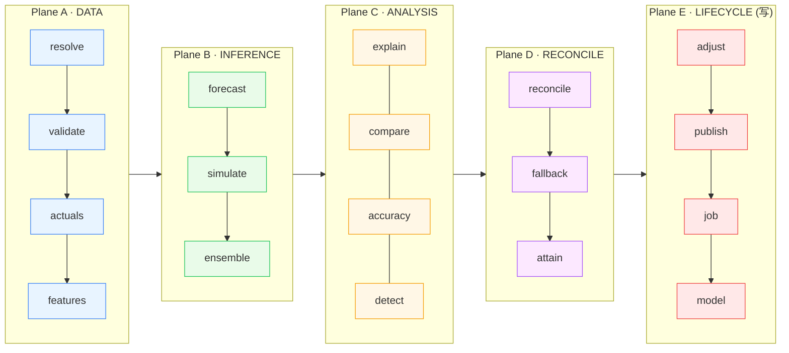
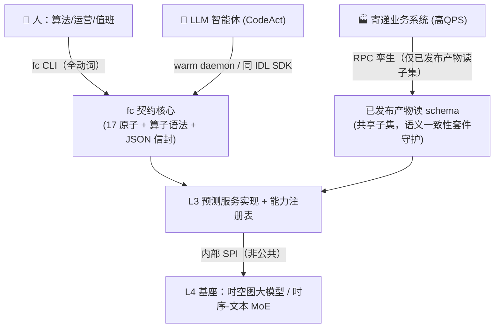
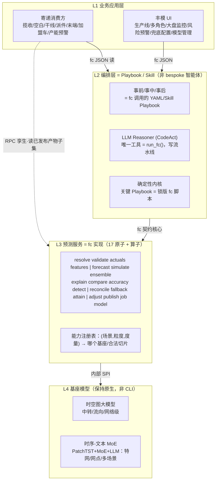
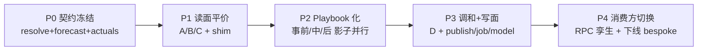

# 顺丰预测智能体架构重构方案 v2.0

## —— 从「按格子堆智能体」到「预测代数 + `fc` 统一 CLI 契约」

> **文档性质**：架构重构方案（Architecture Refactoring Proposal）
> **对标输入**：《预测智能体架构 v1.0》（沙礼，2026-06-16）
> **撰写**：预测算法团队 / 资深产品开发技术架构师
> **生成方式**：Agent Team 多轮审视 + 上网深度调研（CodeAct / MCP Code Mode / ACI 等一手论文与工程实践）
> **日期**：2026-06-16　**版本**：v2.0-draft

---

## 目录

1. [执行摘要（TL;DR）](#1-执行摘要tldr)
2. [v1.0 现状诊断：为什么会"卡"](#2-v10-现状诊断为什么会卡)
3. [预测原子能力提炼：预测代数（Prediction Algebra）](#3-预测原子能力提炼预测代数prediction-algebra)
4. [为什么要做 CLI：技术论证 + 业界证据](#4-为什么要做-cli技术论证--业界证据)
5. [在哪里做 CLI：边界定位](#5-在哪里做-cli边界定位)
6. [`fc` CLI 设计规范](#6-fc-cli-设计规范)
7. [重构后的架构 v2.0](#7-重构后的架构-v20)
8. [覆盖性证明：v1.0 → 原子能力映射](#8-覆盖性证明v10--原子能力映射)
9. [迁移路线（分阶段 Strangler）](#9-迁移路线分阶段-strangler)
10. [风险与缓解](#10-风险与缓解)
11. [哪些**不**做 CLI（边界负空间）](#11-哪些不做-cli边界负空间)
12. [工程治理：版本 / 多租户 / 测试 / 选型 / 组织](#12-工程治理版本--多租户--测试--选型--组织)
13. [参考文献与一手出处](#13-参考文献与一手出处)
14. [附录：契约 Schema / 能力注册表 / 样例 Playbook / 评审处置](#14-附录)

---

## 1. 执行摘要（TL;DR）

**一句话**：v1.0 的根本问题不是某个模块不好，而是它把"组合网格"实现成了"代码工件"——每一个`场景 × 粒度 × 维度 × 时窗 × 操作`的格子都去堆一个智能体 / 一个面板 / 一套对接 API。这条路在工程上必然不可维护。

**重构主张（两步走）**：

1. **提炼预测代数**：把"预测"拆成一组**最小正交的原子操作（动词，17 个）**，与一组**参数算子（名词：场景 / 实体·粒度 / 切片·维度 / 时窗 / 度量 / 版本 / 角色）**彻底分离。网格的*接口面*从"代码"搬进"参数"，复杂度从 `O(动词 × 算子)` 降到 `O(动词 + 算子)`（不可约领域复杂度被收纳进注册表+有界适配，而非消灭，见 §4.7）。
2. **把代数结晶为一个 CLI 契约（`fc`）**，落在「预测服务层(L3) ↔ 智能体层(L2)」的接缝上，并向上贯通到业务应用层(L1)。**一个契约，三类调用方**：人（运营/算法）、LLM 智能体、业务系统。

**直接收益**：下表把"我们自己要达成的 KPI 目标"与"外部方向性证据"分开列——**外部数字来自不同语境（Cloudflare 是压 1.17M token 的 API 面、CodeAct 是通用多工具基准），只能作为"界面/格式确实重要"的方向性佐证，不是我们的预期值**。我们的目标 KPI 将在 P2 影子阶段用*自己的任务*实测（见 §4.4、§9）。

| 维度 | v1.0 现状 | v2.0 目标（我方 KPI，待 P2 实测） | 方向性外部证据 |
|---|---|---|---|
| 智能体形态 | 每格一个 bespoke 智能体 | 智能体 = `fc` 命令的 **Playbook**，bespoke 数→≈0 | CodeAct / smolagents |
| LLM 工具面 | 上百个工具 → 选择退化 | **1 个工具面**（`run_fc()`/SDK）+ 按需 man page；目标：每问 token 数、工具选择准确率显著改善 | Anthropic Code-MCP（↓98.7% 是其 2500+ 工具语境） |
| 新增场景成本 | 新建智能体+面板+对接 | **复用既有基座的"me-too"场景≈注册表加一行**；新基座/新特征场景仍需有界的适配代码（见 §3.3、§4.7 诚实声明） | Cloudflare Code Mode（↓99.9% 是其 1.17M token 语境） |
| 任务成功率/效率 | — | 目标：多步问答动作数、成功率改善（基线后定档） | CodeAct：通用基准上 +~20% 成功率、−~30% 动作 |
| 可复盘性 | 自述日志，不可证 | **复盘=按 run-id 取已存产物**（非重算），命令+退出码可重放审计 | Deterministic Replay / Audit |
| 人机界面 | 人看面板、Agent 走 API（两套） | **同一份契约**，运营/Agent/业务共用 | SWE-agent ACI |

**最关键的三个落地抓手**（架构师强观点）：

- **能力注册表（Capability Registry）** 是真正的承重墙：它让 `--scenario` 可以无限增长而**动词永远冻结**；先投资这里。但要诚实——它把不可约的领域复杂度*收纳*进来了，没有消灭（§4.7）。
- **预测可复现 = 产物存储契约，而非"重算复现"**：`forecast`/`publish` 必须按 `run-id` 持久化输出产物（序列+区间+特征快照哈希+seed+模型摘要）；复盘=取产物，绝不重新推理（§4.6）。这是承重的契约决定，必须在 P0 落，不能拖成 spike。
- **`--dry-run --explain-plan` 从第一天起在所有写操作 Playbook 里强制必选**：防止 LLM 把一个 `--level L4` 的预测在全网扇出炸开的最佳护栏。

---

## 2. v1.0 现状诊断：为什么会"卡"

### 2.1 组合爆炸是结构性的，不是实现细节

v1.0 的预测服务层本质是一个高维网格：

```
≈8 场景(时件/航空/中转/小件/派件/特网/国际/大件/大客户)
× 4 粒度(L1 全网 / L2 业务场·省-省 / L3 城市·网点·场地 / L4 AOI)
× N 切片(收寄产品/揽件段/班次/退栏/场区/波/上下站/线路编码/业务字段/国家流向…)
× 3 时窗(120D 长期 / 2D 短期 / 0D 动态)
× ≈6 操作(问数/解释归因/模拟/预警/诊断/复盘)
```

保守估计 `8×4×3×6 ≈ 576` 个"操作格子"，叠加切片维度后上千。**v1.0 的做法是给格子配工件**：

- 智能体层：事前/事中/事后下挂了一堆"大客户兜底""小区兜底""航空流向""业务场时件""摊位诊断"……每个都是独立逻辑。
- 单项功能：问数查数、解释归因、模拟，又各自重复支持 8 个场景。
- 业务应用层：7 个寄递业务方各自对接。

### 2.2 这套结构的四个致命问题

| 问题 | 表现 | 后果 |
|---|---|---|
| **不可维护** | 一个新场景（如新增"医药冷链"）要新建智能体+面板+对接 | 边际成本恒高，团队被"加格子"绑死 |
| **不一致** | 同一个"归因"在中转和特网里各写一遍，口径漂移 | 下游对预测口径不信任 |
| **不可组合** | "兜底达成预警" = 预测+对齐+兜底+达成，却被焊死成一个黑盒 | 无法复用子步骤，无法灰度单点 |
| **LLM 难导航** | 智能体面对上百个工具/接口，选择准确率退化 | "智能体"实际很笨，且 token 成本爆炸 |

> **诊断结论**：网格是业务的真实复杂度，无法消除；但它**应该被表达为参数，而不是被实现为代码**。这正是重构的全部立足点。

---

## 3. 预测原子能力提炼：预测代数（Prediction Algebra）

### 3.1 第一性原则：**动词 / 算子分离**（最重要的一个决定）

v1.0 把"做什么（操作）"和"对什么做（对象）"纠缠在一起。重构的第一刀就是把它们劈开：

- **动词（原子操作）**：17 个，正交、最小、稳定，**永远不随业务增长**。
- **算子（参数维度）**：作为全局 flag，**业务增长只在这里发生**。

#### 参数算子（名词语法 —— 全局，适用于所有接受目标的动词）

| 算子 | Flag | 含义 | 取值（源自 v1.0） |
|---|---|---|---|
| 场景 Scope | `--scenario` | 预测领域 | 时件/航空/中转/小件/派件/特网/国际/大件/大客户 |
| 实体·粒度 Entity | `--entity` `--level` | 可寻址对象 | L1 全网 / L2 业务场 / L3 城市·网点·场地 / L4 AOI；实体 id 如 `site:SZ-PA-001` |
| 切片·维度 Slice | `--slice`（可重复 k=v） | 实体内子切 | 场区/波/上下站/线路编码/收寄产品/揽件段/班次/退栏/业务字段/国家流向 |
| 时窗 Horizon | `--horizon` | 预测窗口 | 120D 长期 / 2D 短期 / 0D 动态（或显式 `--from/--to`） |
| 度量 Measure | `--measure` | 量纲 | 件 / 重 / 票 / 班次 / 总量 |
| 版本 Version | `--version` `--as-of` | 可复现坐标 | 模型版本 / run-id / 快照时间戳 |
| 角色 Role | `--role` | 多角色预测身份 | 算法 / 业务 / 运营 / 兜底 |

> v1.0 网格里的"一个格子"= 一个**完全绑定的算子元组**。再没有"每格一份代码"。

### 3.2 十七个原子能力（按 5 个 Plane 分层）

记号：
- **I** = 纯幂等（同输入→同输出，无副作用）。
- **I\*** = **存储幂等**：在 `--as-of/--version/run-id` 锁定下，返回**当时持久化的产物**（按 run-id 取，**不重新推理**）。这是一个*存储契约*，不是"重算会得到同样数字"的断言——真实模型有 GPU 非结合性、库版本、特征回填、MoE 路由抖动，重算不可逐字节复现（见 §4.6）。
- **W** = 写状态（仅 Plane E）。

> 评审纳入：相比初稿的 15 原子，本版**补入 `validate`（输入数据健康门）与 `adjust`（人工修正持久化）**两个一等原子，并把"告警生命周期"显式划到编排层（§3.4）。这三处是初稿"无需新动词"声称真正会破的地方。

#### Plane A — DATA 数据底座

| # | 原子 | 定义 | 输入→输出 | 幂等 | 调用方 |
|---|---|---|---|---|---|
| A1 | `resolve` | 解析/校验算子元组为规范实体集；展开 L1→L4，列出合法切片与能力位；**返回下游 `forecast` 的预估成本**（供成本守卫） | 元组 → 规范实体列表 + 能力标记 + 成本预估 | I | 所有人（廉价预检） |
| A2 | `actuals` | 取真值观测（用于对齐/复盘） | 元组+时间范围 → 时序（件/重/票） | I\* | 问数、复盘、对账 |
| A3 | `features` | 取/物化喂给预测的特征视图（日历/天气/事件/上游流向） | 元组+范围 → 特征帧 | I\* | 推理、归因、模拟 |
| A4 | `validate` | **输入数据健康门**（区别于 `resolve` 的目标合法性）：缺失真值、特征陈旧、晚到回填、离群输入检测 | 元组+范围 → 健康报告 + 阻断/放行 | I\* | 推理前置、生产线门禁 |

> **为什么 `validate` 必须独立**：`resolve` 校验"目标能不能预测"，`validate` 校验"数据值不值得信"。在静默坏数据上预测是生产事故第一大类；把它折进 `forecast` 会让失败不可观测。

#### Plane B — INFERENCE 推理（模型边界）

| # | 原子 | 定义 | 输入→输出 | 幂等 | 调用方 |
|---|---|---|---|---|---|
| B1 | `forecast` | **核心动词**：对元组+时窗出预测；按能力路由到时空图基座或时序-文本 MoE 基座 | 元组+时窗(+特征/版本) → 预测序列 + 区间 + run-id | I\* | 所有智能体/UI/业务 |
| B2 | `simulate` | 反事实/情景预测（人工预测覆盖、what-if 事件干预） | 元组+干预规格 → 情景预测 + 相对基线的 delta | I\* | 模拟智能体、规划方 |
| B3 | `ensemble` | 多 run / 多角色融合为一条序列（多角色预测融合） | run-ids/角色输出+权重 → 融合序列 | I | 多角色预测、丰模流水线 |

#### Plane C — ANALYSIS 分析（对输出的只读推理）

| # | 原子 | 定义 | 输入→输出 | 幂等 | 调用方 |
|---|---|---|---|---|---|
| C1 | `explain` | 归因：把预测/数值分解到驱动因子（特征归因/分解/top movers） | run-id 或元组 → 排序的驱动贡献 | I\* | 解释归因、复盘 |
| C2 | `compare` | 比对两条序列（版本/时窗/角色/预测-vs-真值） | 两元组/run-id → 差异指标、delta | I\* | 复盘、监控、问数 |
| C3 | `accuracy` | 计算准确率/误差指标（准确率、WAPE、bias） | 预测元组+真值窗 → 指标集 | I\* | 大盘监控、复盘 |
| C4 | `detect` | 在序列上做异常/波动/风险检测（波动风险预警、风险预警） | 序列/元组+规则 → 标记事件 + 严重度 | I\* | 事中风险智能体、产能预警 |

> **关于"诊断"（评审纳入修正）**：v1.0 的"摊位诊断 / 提前诊断"原则上是 `detect → explain → compare` 的组合，但物流根因是**跨实体、需遍历实体图**的（平湖涨了→是上站入流？是粤→沪改流？是大闸蟹季事件？还是兄弟网点吸量？）。`explain`（单 run 特征归因）+ `compare`（两序列）**不会自动**组合成图遍历根因。因此 `diagnose` **不作为新动词**，而是固化为**确定性内核里的一条锁定 Playbook**（锁定遍历顺序：查上站→查兄弟→查事件→排序），而**不是每次让 LLM 即兴编排**——否则诊断质量退化为 prompt 工程、且丧失可复现性，与本方案主旨相悖。详见 §7.2。

#### Plane D — RECONCILIATION 调和（后处理/兜底层）

| # | 原子 | 定义 | 输入→输出 | 幂等 | 调用方 |
|---|---|---|---|---|---|
| D1 | `reconcile` | 层级一致性（L1↔L4 求和一致）、拼接（拼接配置）、跨切片平衡 | 多层级预测 → 一致化后的集合 | I | 丰模流水线、规划方 |
| D2 | `fallback` | 应用兜底策略：检测不过/覆盖缺口时替换/混合（AI 兜底） | 预测+策略+兜底源 → 保覆盖序列 + 溯源 | I\* | 高峰兜底、兜底达成预警 |
| D3 | `attain` | 度量兜底达成（vs 兜底目标）与缺口（产能预警） | 一致化预测+计划/目标 → 达成率、缺口、告警 | I\* | 兜底达成预警、产能预警 |

#### Plane E — LIFECYCLE 生命周期（**唯一**写状态的地方）

| # | 原子 | 定义 | 输入→输出 | 幂等 | 调用方 |
|---|---|---|---|---|---|
| E1 | `adjust` | **人工修正持久化**：把运营/角色的覆盖值写成带溯源、可被下游消费的权威产物，且能**被新 run 取代而不丢历史**（区别于 ephemeral 的 `simulate`） | 目标+覆盖值+理由 → 修正产物句柄 | W（按 idempotency-key） | 运营、兜底角色 |
| E2 | `publish` | 把一个 run（或 `adjust` 产物）提升为可寻址、带版本、可消费、**不可变**的产物（寄递读的就是它） | run-id+渠道 → 发布版本句柄 | W（按 run-id 幂等） | 丰模流水线、发布 |
| E3 | `job` | 调度/跟踪/重放预测流水线（预测生产线编排） | job 规格 → job-id、状态、血缘 | W | 丰模编排 |
| E4 | `model` | 模型生命周期：列出/锁定/晋升/回滚版本（模型管理） | 模型操作 → 版本状态 | W | 平台 / MLOps |

> **为什么 `adjust` 必须独立**：`simulate` 是临时 what-if，不落权威态；但运营改了"明天平湖的数"，下游调度*真的*会消费它——这必须是带溯源、幂等、可取代的**写**，是 `simulate` 喂不了的写面缺口。预测组织的成败往往就在人工修正工作流上。

### 3.3 为什么是这 17 个、这 5 层

五个 Plane 沿数据流的自然梯度排列：**底座 → 推理 → 只读分析 → 调和 → 写状态**。

- **写面（W）被收敛在 Plane E**（`adjust/publish/job/model`），其余全是纯函数或"存储幂等"——这正是让 LLM 可以**放心随便调**、让业务系统可以**安全重试**的关键安全属性。
- 每一个 v1.0 能力都能映射到"1 个原子 + 算子"或"少数原子的*固定*组合"（完整映射见 §8），**没有任何一个需要为单个格子新增动词**。这就是正交性的可证明收益。

### 3.4 告警生命周期不是 `fc` 原子（显式划界）

`detect`/`attain` 只**发射**事件（无状态）。但 v1.0 的"预警"是一个**有状态**系统：去重、firing/acknowledged/resolved 状态机、抑制窗口。§7.2 那条每 30 分钟 cron 的 Playbook 若每命中就 `notify()`，会造成**告警风暴**。

**处置**：告警生命周期**显式置于编排层之外的独立告警系统**（如 Alertmanager 类组件），`fc detect` 只产出带指纹的事件，去重/状态/抑制由该系统负责。`notify()` 在 Playbook 里是对该系统的调用，**不是** Playbook 原语。这样保持 `fc` 无状态、可组合，同时不丢失运营所需的告警状态。



---

## 4. 为什么要做 CLI：技术论证 + 业界证据

> 本节的论据全部来自一手论文与工程实践（出处见 §12）。这不是审美偏好，而是**有量化证据**的工程决策。

### 4.1 证据一：代码化动作 > JSON 工具调用（CodeAct, ICML 2024）

让 LLM 用**可执行代码/命令**作为动作，而非一次性 JSON 工具调用：

- 在 M3ToolEval（82 个多工具多轮任务）上，**绝对成功率最高提升约 20%**，同时**完成同样任务所需动作数最多减少约 30%**。
- 在 17 个被测 LLM 中，CodeAct 在 **12/17** 上成功率更高、在 **12/17** 上平均轮数更低——质量与效率双赢，且跨模型稳健。
- 机理：代码天生支持循环/条件/组合/复用，一个代码块能替代多次 JSON 往返。

> ⚠️ **语境校准**：该数字测于*通用多工具基准*，不是"15 动词 + 类型化注册表"的受限领域 CLI。它对我们是**方向性证据**（"格式/组合确实重要"），**不是**我们的预期 delta；我们自己的 delta 在 P2 影子阶段实测（§9）。

**对我们的含义**：智能体不该"选工具"，而该"写一条 `fc` 流水线"。

### 4.2 证据二：工具爆炸是真实退化源；代码/CLI 模式量级降本

- **Anthropic《Code execution with MCP》（2025-11）**：把工具表达为"文件系统上的代码、按需读取"后，一个代表性工作流的上下文从 **~15万 token 降到 ~2千 token，↓98.7%**。两个失效模式被点名：(a) 工具定义堆满上下文窗口；(b) 中间结果反复过模型烧 token。对应的解法正是 **渐进式披露**（按需读 man page）、**结果在代码内过滤**、**隐私**（数据不进模型上下文）、**状态/技能复用**。
- **Cloudflare《Code Mode》**：把 MCP schema 转成带类型的 TS API，只暴露 `search()`/`execute()` 两个工具，把 **2500+ 接口从 117 万 token 压到 ~1千 token（↓99.9%）**，且**与 API 面大小无关恒定**。其承重论断：*"LLM 见过海量代码，却没见过多少 'tool call'。"*

> ⚠️ **语境校准**：98.7% / 99.9% 是 Anthropic/Cloudflare 在**压 2500+ 工具、1.17M token API 面**时的收益。`fc` 只有 17 个动词，**绝不会**复刻这个量级。我们能拿到的是"上百个场景工具/接口 → 1 个工具面 + 按需 man page"这条*同向但小得多*的降本，真实幅度以 §4.4 自有 KPI 为准。

**对我们的含义**：v1.0 的"上百个场景工具"恰恰落在被点名的反模式上；`fc` + man page 就是那条降本路径——量级远小于上述外部数字，但方向一致。

### 4.3 证据三：界面工效本身决定上限（SWE-agent ACI, NeurIPS 2024）

Agent-Computer Interface（ACI）研究证明：**不改模型、只改界面工效**，就能把 SWE-bench pass@1 从 ~3.8% 拉到 **12.47%（≈3–5×）**（注：这是*代码修复*任务上的具体数字；可迁移的是"界面工效决定上限"这一**定性结论**，而非那个 3–5× 的具体倍数）。其 5 条 ACI 设计原则可直接迁移成 CLI 规范：

1. **命令简洁**、输出受上下文限制（如搜索结果截断到 ~50）；
2. **环境反馈翔实**（带行号的窗口化视图、省略标记）；
3. **护栏/防错**（非法操作被拒，返回精准错误）；
4. **动作合并**（把多个低级操作折叠成一个原子 `{思考,命令}`）；
5. **抑制无用输出**（只呈现相关结构）。

### 4.4 证据四：Unix 哲学天然契合 LLM 的 I/O

小而正交的命令 + 文本/JSON 流 + 管道，是**最早的可组合界面**；而**文本流恰是 LLM 唯一的输入输出形式**。`grep | sort | uniq -c | head`——四个工具一条分析流水线——正是我们希望智能体生成的形态。可脚本化、幂等、确定性退出码、可管道的 JSON，既给了组合性，又给了机器可校验的反馈。

### 4.5 证据五：可审计、人机同界面、可测试

- **审计危机的解法**："模型写自己的日志"不可信——它记录的是它*以为*做了什么。CLI 让 **shell/进程层（而非模型）成为事实来源**，产出防篡改、外部捕获的溯源（命令 + 参数 + 退出码 + stdout 就是可重放记录，无需重跑即可重建"当时跑了什么"）。
- **人机同界面**：值班规划员和事中智能体跑**同一条命令**；人学到的口径直接沉淀为智能体的 Playbook。
- **可测试**：L3/L4 可以作为 CLI 的契约测试套件独立验证，与 React 面板、业务 API 完全解耦（测试策略见 §12.4，注意区分确定性原子的 golden-file 与推理原子的统计等价）。

### 4.6 ⭐ 承重决定：预测可复现 = 产物存储契约，**不是**"重算复现"

> 这是整份方案最承重、也是初稿最容易出错的一点，单列强调。

**问题**：命令可重放（`fc forecast … --as-of X` 能再跑）**≠** 数值可复现（再跑得到*当天同样的数字*）。真实生产模型本质非确定：GPU 非结合性、库版本未钉死、特征库会变（晚到真值回填过去日期的 `actuals`）、MoE 路由抖动、ensemble 权重漂移。若 `fc forecast --as-of 2026-06-10` 下周返回**不同**数字，则**整个复盘/审计故事崩塌**——而这恰是本方案相对"模型自述日志"的核心卖点。

**契约（必须 P0 落地，不能拖成 spike）**：

1. **产物即真相**：每次 `forecast`/`simulate`/`adjust` 必须按 `run-id` 持久化**输出产物**——序列 + 区间 + **特征快照哈希** + **seed** + **模型摘要(digest)** + 代码/配置版本。
2. **复盘 = 取产物，绝不重算**：`fc forecast --replay <run-id>`（或 `--as-of` 命中已存产物）**读取**存档；若被要求重新推理则**显式大声失败**，而非偷偷给出新数字。
3. **`I*` 的精确定义**（已在 §3.2 改）：幂等 = "对锁定坐标返回*持久化产物*"，**不是**"重算逐字节相同"。
4. **不可变发布**：`publish` 产物不可变并自描述其 schema 版本（让跨版本复盘成立，见 §12.1）。

这把"可复现"从一个*运行期承诺*降格为一个*存储契约*——后者可工程保证，前者不可。

### 4.7 ⭐ 诚实声明：组合复杂度是被**搬走**了，不是被**消灭**了

`O(动词×算子) → O(动词+算子)` 这个收益**只成立于"我们手写的、动词层的代码工件数量"**；它**不**成立于系统总复杂度。不可约的 `O(场景×基座×度量×粒度×切片)` 领域逻辑没有消失，而是**搬进了两处**：

1. **能力注册表**（路由表）；
2. **L3 里每个 (场景, 基座) 的 SPI 适配代码**——不同基座的特征映射、各场景的合法切片、各层级的 reconcile 拓扑、区间语义，都是会随场景增长的真实代码。

因此必须区分两类"新增场景"：

| 类型 | 含义 | 成本 |
|---|---|---|
| **me-too 场景** | 复用*既有*基座 + *既有*特征管线 | ≈ 注册表加一行，接近"零新代码" |
| **新基座/新特征场景**（如医药冷链） | 需新特征视图 / 新基座适配 / 新切片词表 / 新 reconcile 拓扑 | **真实有界工程量**，不是一行 YAML |

`--slice raw=` 逃生舱的存在本身就承认抽象会泄漏。**真实收益的准确表述是**：把*智能体/UI/API 表面*从 `O(网格)` 降到 `O(1)`、把*动词数*冻结，代价是把不可约领域复杂度**收纳**进"注册表 + 有界数量的基座适配器 + 各场景特征/切片配置"。§9 的迁移估算需对"me-too vs 新基座"分别给工时。

### 4.8 反方与风险（诚实对待）

| 反方论点 | 我们的应对 |
|---|---|
| 代码执行 → RCE（OWASP AIVSS 给解释器-工具场景 CVSS 9.4） | 执行体沙箱化（容器/microVM/V8 isolate）、最小权限、出网白名单；写面再加 RBAC + 幂等键 |
| 提示注入无万无一失的确定性防御 | 分层校验 + 允许列表 + 出网网关；写操作强制 `--dry-run` + 人审门 |
| 何时 JSON 工具仍更优 | 极窄、高可信、低时延、且要彻底杜绝任意代码执行的场景，保留 JSON 快路径 |
| LLM 臆造 flag | 带类型的自描述契约（`--schema`/man page）+ 精准报错教模型自纠（见 §6.4、§6.7） |
| 时延：沙箱启动 | 用毫秒级 isolate 而非重容器；0D 热路径根本不走 CLI（§11） |

> **结论**：CLI 化不是"把按钮换成命令"，而是把**预测能力的契约**从"面板/工具的偶然形态"提升为"可组合、可复现、人机共享的一等公民"。证据链支持这一决策。

---

## 5. 在哪里做 CLI：边界定位

**结论：在「预测服务层(L3) ↔ 智能体层(L2)」的接缝上引入一条水平 CLI 契约，并向上贯通到 L1。** `fc` 即是 L3+L4 对外的**唯一公共面**。其上的一切（智能体、丰模 UI、寄递系统）都只通过：

- **`fc`（CLI）** —— 面向人 / LLM 智能体；
- **RPC 孪生（同契约，gRPC/HTTP）** —— 面向高 QPS 业务系统。

**一个共享契约核心，两类传输与不同表面（评审纠偏）。**

> 初稿"一个契约两种传输、IDL 生成防漂移"过度承诺了。IDL 只保证**签名**一致，不保证**语义**一致。CLI 有 RPC 孪生结构上做不到的语义（ndjson 流式 + 中途错误、退出码当谓词、`--dry-run --explain-plan`、stdout/stderr 分离、管道组合、按需 man page）。务必精确划界：

- **真正跨传输共享的，是"已发布产物的读 schema + `resolve`/目标语法"这个*子集***，不是全套动词。
- **RPC 孪生只暴露这个严格子集**（读 `publish` 产物、可选 `resolve`），**明确不含**推理/组合/写。高 QPS 业务方读的是物化的已发布产物，不在 RPC 里跑 `forecast`。
- **跨传输一致性靠语义一致性套件**：同一 `run-id` 经 CLI 与 RPC 读出的序列必须**逐字节相同**；并文档化"哪些原子是 CLI-only by design"。不承诺维护不了的"全等价"。



**为什么是这条缝（工程理由）：**

| 理由 | 说明 |
|---|---|
| 可组合 | 原子正交 → 可管道。`fc forecast … \| fc reconcile … \| fc attain …` 取代一个 bespoke "兜底达成预警"智能体 |
| 契约稳定 | 算子语法是唯一随业务增长的东西；动词冻结。新（me-too）场景 = 新 `--scenario` 值 + 注册表登记，**零新动词**（新基座场景仍需有界适配，见 §4.7） |
| LLM 亲和 | 把"在上百个工具里选"变成"写一条流水线"——这是最大杠杆 |
| 可复现 | `--as-of`/`run-id` 命中**已存产物**（非重算），每个输出都是可重放坐标（§4.6） |
| 人机同面 | 值班员与智能体走同一契约，可审计为命令历史 |
| 可测/解耦 | L3/L4 用契约测试套件验证，与 UI / 业务 API 解耦 |

---

## 6. `fc` CLI 设计规范

### 6.1 命令形态

```
fc <plane?>:<verb> [TARGET] [算子-flags] [verb-flags] [global-flags]
```

动词扁平（`fc forecast`），冲突时用 plane 命名空间（`fc data:actuals`）。**一个二进制、一套鉴权、一份配置、一个输出契约。**

### 6.2 子命令 ↔ 原子

```
fc resolve     fc forecast    fc explain     fc reconcile   fc adjust
fc validate    fc simulate    fc compare     fc fallback    fc publish
fc actuals     fc ensemble    fc accuracy    fc attain      fc job
fc features                   fc detect                     fc model
```

### 6.3 全局 flag = 算子语法

```
--scenario   中转|航空|特网|国际|大件|小件|派件|时件|大客户
--entity     <id>            如 site:SZ-PA-001 | flow:粤->沪 | country:US
--level      L1|L2|L3|L4
--slice      场区,波,上下站,线路编码 | 收寄产品 | 业务字段=大闸蟹 …   (可重复, k=v)
--horizon    120D|2D|0D       (或显式 --from/--to)
--measure    件|重|票|班次|总量
--version    <model-ver>      --as-of <ISO8601>     # 复现锁
--role       算法|业务|运营|兜底
--profile    <name>           # 环境/租户/凭据 bundle
--output     json|table|ndjson|csv|chart
--dry-run    --explain-plan   # 显示将执行什么、成本、触及实体
--trace-id   <id>             # 可观测关联
--schema-version <v>          # 消费方钉定信封大版本（向后兼容，见 §12.1）
--on-error   fail-fast|skip|require-all   # 流式部分失败策略（见 §6.8）
```

> **契约用稳定 ASCII 枚举 ID，中文只作展示标签（评审纳入）**：上面为可读性写了中文取值，但*契约/注册表/信封的主键必须是稳定 ASCII*（`scenario=transit|air|hub|intl|heavy|small|delivery|ticket|key-account`），中文是 i18n 展示层。理由：shell 引号/编码、LLM 分词、ID 与展示名解耦。**绝不**让中文展示串成为注册表或信封的主键。

### 6.4 输出契约（最承重的设计决定）

每个命令在 stdout 产出**稳定信封**；人类格式只是它的一个**视图**，绝不是另一套代码路径。

```json
{
  "schema": "fc/v2",
  "atom": "forecast",
  "target": {"scenario":"transit","entity":"site:SZ-PA-001","level":"L3",
             "slice":{"wave":"W2"},"horizon":"2D","measure":"parcel"},
  "version": {"model":"st-graph@3.4.1","as_of":"2026-06-16T08:00:00+08:00",
              "run_id":"r-9f2a"},
  "result": { "series":[{"t":"2026-06-17","yhat":182340,"lo":171002,"hi":193880}],
              "meta":{"base":"st-graph","coverage":1.0} },
  "diagnostics": [],
  "status": "ok"
}
```

规则：`--output table/chart` 渲染**同一个对象**；`--output ndjson` 每实体一信封（便于 `resolve … | xargs … fc forecast` 扇出）；**错误进 stderr**（`{status:"error",code,...}` 信封），**数据永远进 stdout**。

### 6.5 组合、退出码、管道

```bash
# 事中 兜底达成预警，一条流水线 —— 取代一个 bespoke 智能体：
fc forecast --scenario 中转 --level L3 --horizon 2D --measure 件 --output ndjson \
  | fc reconcile --against L2 --output ndjson \
  | fc fallback  --policy 高峰兜底 --output ndjson \
  | fc attain    --plan plan://peak-2026 --threshold 0.92 \
  | jq 'select(.result.gap > 0)'
```

退出码（让 Playbook 可确定性分支）：

| 码 | 含义 | 用途 |
|---|---|---|
| `0` | ok | 正常 |
| `10` | 软异常/阈值击穿 | 让 `detect`/`attain` 可当 shell 谓词 |
| `20` | 覆盖缺口（已启用 fallback） | 兜底链路分支 |
| `40` | 非法算子元组 | 立即失败、教模型自纠 |
| `50` | 上游/模型不可用 | 重试/降级 |
| `60` | 鉴权/RBAC 拒绝 | 安全分支 |

### 6.6 配置与 Profile

`~/.fc/config.toml` + `--profile`：打包租户、默认场景、凭据、base-URL、默认时窗、输出模式。CI 用 `FC_PROFILE=ci`；值班员用 `--profile sz-transit`。Profile 是"同一条命令在 dev/stage/prod 多租户下都安全"的机制。

### 6.7 幂等与 dry-run

- 纯/分析原子天生安全；推理原子按 `--as-of/run-id` 命中**已存产物**（非重算，见 §4.6）。
- 写原子（`adjust/publish/job/model`）带 `--idempotency-key`；同键重跑返回上次结果，绝不重复写。
- `--dry-run --explain-plan` 打印解析后的实体集、选中的模型基座、预估成本/耗时、写副作用——在任何 `publish`/`fallback`/`adjust` 前**强制必选**。

### 6.8 流式与部分失败语义（评审纳入 · P0）

整个组合卖点是 `fc forecast --output ndjson | fc reconcile | …`。一旦每实体一信封地流 N 个实体，"单标量退出码"模型立刻失效：第 4000/50000 个实体失败时，Unix 管道只给最后一段的退出码、无事务边界、下游已对前 3999 个动作过了。**必须显式定义**：

1. **逐记录状态**：ndjson 每行自带 `status: ok|error|skipped`（错误行携带 `code/error`，但**留在 stdout 流里**，不混入 stderr，以免破坏管道对齐）。
2. **进程退出码是聚合**：`0`=全 ok；`10`=部分失败（partial）；`≥40`=致命（无法继续）。
3. **下游对混合流的契约由 `--on-error` 决定**：`fail-fast`（遇错即停）/`skip`（跳过错误记录继续）/`require-all`（任一错则整体失败）。
4. **流尾 `summary` 信封**：最后一行是 `{"atom":"summary","counts":{"ok":..,"error":..,"skipped":..}}`，供 Playbook/LLM 一眼判断。
5. **写 + 流 + 部分失败 = 必须有事务/暂存边界**：`publish`/`fallback`/`adjust` 提供 `--atomic`（全有或全无，先写 staging 再原子提交），**绝不允许半网生效**——这正是 `--dry-run` 拦不住、却最危险的"全网扇出炸开"。

```jsonc
// fc forecast --output ndjson 的混合流示例
{"atom":"forecast","target":{"entity":"site:SZ-PA-001"},"status":"ok","result":{...}}
{"atom":"forecast","target":{"entity":"site:SZ-PA-014"},"status":"error","code":50,"error":{...}}
{"atom":"summary","counts":{"ok":49999,"error":1,"skipped":0}}   // 进程退出码=10
```

### 6.9 SLO / 成本模型（评审纳入 · P1）

契约必须给每个原子定**时延/吞吐/成本类**，否则 `--explain-plan` 的"预估成本"、§10 的"成本守卫"、Playbook 超时都无从谈起。

| 原子类 | 代表 | p50 / p99 目标 | 最大扇出 | 成本类 |
|---|---|---|---|---|
| 廉价读 | `resolve/validate/actuals/features` | 50ms / 300ms | — | cheap-read |
| 推理 | `forecast/simulate/ensemble` | 视基座，秒级 / 十秒级 | 受 `--level` 守卫 | inference |
| 分析 | `explain/compare/accuracy/detect` | 200ms / 2s | — | analysis |
| 调和 | `reconcile/fallback/attain` | 500ms / 5s | 层级规模 | reconcile |
| 写 | `adjust/publish/job/model` | 200ms / 2s（不含底层批作业） | — | write |

**成本模型**：`cost ≈ 实体数 × 基座单价 × 时窗系数`。`resolve` **回传下游 `forecast` 的预估成本**，成本守卫据此在扇出*之前*拒绝过宽的 `--level L4` 全网请求（而非事后）。

### 6.10 鉴权 / RBAC

场景级 + 实体级 RBAC 在**契约层**强制（非 UI 层）。如：`转运中心`角色可对 `--scenario 中转` 做 `forecast/reconcile/publish`，但对 `航空` 只读 `forecast`。写原子需要更高权限。每次调用携带身份；`--role` 选的是**预测人格**（多角色），与**安全主体**正交。

### 6.11 可观测

每次调用发结构化事件（atom、目标元组、版本、时延、成本、退出码、trace-id）。于是**大盘监控、风险预警就只是 `fc` 遥测 + 定时 `fc accuracy`/`fc detect` 的看板**——不再是独立子系统。这把 v1.0 的两个平台能力收敛进了同一个 Plane。

---

## 7. 重构后的架构 v2.0

### 7.1 分层重画



> **承重墙**：L3 的**能力注册表**让 `--scenario transit` 路由到时空图、`--scenario special-net` 路由到时序-文本 MoE——**智能体永远不选模型**，`forecast` 按能力查表自己选。新 me-too 场景 = 注册表加一行；新基座/新特征场景另需有界适配代码（§4.7）。

### 7.2 智能体 → Playbook（核心变换）

v1.0 的智能体是**代码**。v2.0 的智能体是**声明式 Playbook**（确定性）+ 可选的 **LLM Reasoner**（自适应）。

示例——*事中 波动风险预警* 作为 Playbook：

```yaml
name: 事中-波动风险预警
schedule: "*/30 * * * *"
defaults: { scenario: 中转, level: L3, horizon: 0D, measure: 件 }
steps:
  - run: fc forecast --output ndjson
  - run: fc detect --rule 波动 --severity high --output ndjson   # exit 10 ⇒ 命中
  - on_exit: { 10: notify(收派与安全中心, payload=$last) }
```

**`diagnose` 作为确定性内核 Playbook（评审纳入）**——根因要遍历实体图，不能每次让 LLM 即兴编排：

```yaml
name: kernel/diagnose          # 锁定遍历顺序，确定性、可复现
inputs: { entity, as_of }
steps:
  - run: fc compare --entity $entity --as-of $as_of --against baseline   # 确认异常幅度
  - run: fc compare --entity upstream($entity) --as-of $as_of            # 1) 查上站入流
  - run: fc compare --entity siblings($entity) --as-of $as_of            # 2) 查兄弟吸量
  - run: fc explain --entity $entity --as-of $as_of --factors events     # 3) 查事件(大闸蟹季…)
  - rank_by: contribution                                                # 4) 排序根因
```

v1.0 里每个事前/事中/事后能力都变成这样一个 Playbook（组合见 §8）。**bespoke 智能体数 → ≈0；可复用原子 → 17。**

### 7.3 LLM = CodeAct over `fc`（工具爆炸的解药）

LLM 智能体只被授予**一个**能力面：调用 `fc` 契约，外加 `fc --help`/`fc <verb> --schema` 的按需披露。它通过**组合一条流水线**来推理。例如 hermes 问答 skill 回答"为什么深圳平湖场地明天中转件涨了？"：

```bash
fc forecast --scenario transit --entity site:SZ-PA-001 --horizon 2D --measure parcel --output json
fc compare  --entity site:SZ-PA-001 --as-of yesterday --against today
fc explain  --run-id r-9f2a --top 5        # → 驱动因子，再做自然语言综合
```

> **执行模型（评审纠偏 · P1）**：`fc` 定义的是**契约**；**进程级 spawn 是 debug/审计路径，不是 Agent 热路径**。一次问答要发多条 `fc`，若每条都冷启（进程 + 鉴权 + 配置 + 注册表 + 模型预热）会到秒~十秒级。Agent 应绑定到**同一 IDL 生成的进程内 SDK** 或**常驻 `fc` daemon/会话**（模型常热、注册表缓存）。"契约是资产、传输可协商"——这反而强化主旨：人/审计走 CLI 二进制，Agent 走 warm 绑定，二者同契约。交互式问答需设时延预算（§6.9）。

它优于上百个 MCP 工具的原因：模型的强项是**代码生成**而非"工具菜单选择"；稳定契约 + man page 在分布内；流水线可检查、可重放、可单测。**这正好对接你既有的 LangGraph + 确定性内核 + 追问闭环设计**——确定性内核跑*锁版* `fc` 脚本（如上 `kernel/diagnose`），追问闭环用精炼后的算子重跑同一条 `fc`。

### 7.4 两类消费方共用契约核心（不是全等价）

- **寄递**：通过 **RPC 孪生**读 `fc publish` 的**已发布产物**（高 QPS、物化）——共享的是*产物读 schema*，由**语义一致性套件**保证同 `run-id` 经两路读出逐字节相同（§5）。RPC 孪生**不含**推理/组合/写。规划员排查差异时，比对的是"调度器读到的已发布产物" vs "CLI 读到的同一 `run-id` 产物"。
- **丰模 UI**：变成 `--output json` 的渲染器 + 一个薄命令构建 UI。面板不再 bespoke；加（me-too）场景 = 加一个下拉值，而非加一个面板。

---

## 8. 覆盖性证明：v1.0 → 原子能力映射

> 目的：证明 17 原子 + 算子能**无遗漏地**表达 v1.0 的全部能力，且**没有任何格子需要为单个场景新增动词**（新基座场景的有界适配成本见 §4.7）。

| v1.0 工件 | v2.0 组合 |
|---|---|
| 预测问数查数 | `actuals` + `forecast` + `compare` |
| 预测解释归因 | `explain`（+ `compare`） |
| 预测模拟 | `simulate`（人工预测混合用 `ensemble`） |
| **人工预测覆盖（落权威态）** | **`adjust`**（带溯源、幂等、可取代）→ `publish` |
| **数据健康门（预测前置）** | **`validate`**（缺失/陈旧/回填/离群） |
| 事前 兜底AI诊断 / 大客户·小区兜底 | `validate`→`forecast`→`detect`→`fallback`→`attain` Playbook |
| 事前 AI客户洞察 / AI预测分析 / AI审核分析 | `compare` + `explain` + `detect`（LLM 综合叙事） |
| 事中 波动风险预警（航空流向/场时件/特网/小件） | `forecast`→`detect`（场景/切片 = `--scenario`/`--slice`） |
| 事中 兜底达成预警（含滚动） | `reconcile`→`fallback`→`attain`（滚动 = `schedule`） |
| 事中 摊位诊断 / 提前诊断 | **`kernel/diagnose` 锁定 Playbook**（图遍历根因，§7.2） |
| 事后 预测复盘（8 维度） | `accuracy` + `compare` + `explain`，按 `--as-of`/`run-id` **取已存产物**（§4.6；8 维 = `--scenario`） |
| 多角色预测 | `forecast --role …` × N → `ensemble` |
| 大盘监控 / 风险预警 | 定时 `accuracy` / `detect` + 遥测看板 |
| **告警去重/状态/抑制** | **编排层独立告警系统**（非 `fc` 原子，§3.4） |
| 兜底/拼接/检测配置 | 作为 `fallback`/`reconcile`/`detect` 的策略输入 |
| 预测生产线 | `job` 编排上述 |
| 模型管理 | `model` |
| 产能预警 | `attain --plan … --threshold …` |
| 大盘场景（时件/航空/中转/小件/派件） | `forecast` + 算子（`--scenario`/`--level`/`--slice`/`--measure`） |
| 单项场景（特网/国际/大件/大客户） | 同上，仅算子取值不同 |

**结论：v1.0 每个格子都可达；单场景无需新动词，新基座场景仅需有界适配。**✅

---

## 9. 迁移路线（分阶段 Strangler）

> 排序原则：**先读后写、先影子后切换、先契约后消费方。**

> **P0 必须包含四个"契约塑形"决定**（评审 P0-1~P0-4，retrofit 代价极高）：①产物存储契约（§4.6）；②流式部分失败语义（§6.8）；③复杂度诚实声明 + me-too/新基座工时分档（§4.7）；④跨传输共享子集 + 语义一致性套件（§5）。这四条若不在冻结期定，后面改契约会很贵。

| 阶段 | 周期 | 目标 | 验收门 |
|---|---|---|---|
| **P0 契约冻结** | 4–6 周 | 批准算子语法 + **17** 原子签名 + JSON 信封为 `fc/v2`；**敲定上述 4 个契约塑形决定**；建**能力注册表**与 `resolve/validate`；SPI 适配两大基座，交付 `resolve/validate/forecast/actuals` + 产物存储 | 中转+特网：确定性原子 golden-file 绿 + 推理原子产物可按 run-id 回取 |
| **P1 读面平价** | 6–8 周 | 出齐 Plane A/B/C 原子；把现有"问数/解释/模拟"单项功能包成**调用 `fc` 的薄 shim**（Strangler） | shim 输出对抽样网格与旧实现**统计等价**（确定性部分逐字节，推理部分按 §12.4 阈值） |
| **P2 Playbook 化** | 8–10 周 | 用 Playbook + LLM CodeAct 重建事前/事中/事后；与 v1.0 智能体**影子并行**对比；大盘监控/风险预警迁到 `fc` 遥测 + 告警系统；**实测自有 KPI**（§4.4） | 每场景影子一致率 ≥ 阈值方可切换 |
| **P3 调和 + 写面** | 6–8 周 | 出齐 Plane D + `adjust/publish/job/model`（含 `--atomic` 事务边界）；丰模流水线切到 `job`；一个寄递消费方接 RPC 孪生作金丝雀 | 金丝雀已发布产物与旧实现 diff = 0；跨传输语义一致性套件绿 |
| **P4 消费方切换 + 下线** | 滚动 | 其余寄递切 RPC 孪生；丰模面板转 JSON 渲染器；每个 bespoke 智能体/API 影子验证后删除 | 契约成为唯一入口 |

> **工时分档（§4.7）**：每个待迁场景先归类——*me-too*（复用基座+特征，≈注册表一行）或*新基座/新特征*（需有界适配代码）。迁移排期按此分档给工时，不可一刀切"加一行"。



---

## 10. 风险与缓解

> 注：以下风险中，初稿被评审标记为"承重却被轻描淡写"的四项（预测可复现、流式部分失败、复杂度去向、双传输漂移）已**升级为 §4.6/§6.8/§4.7/§5 的正文契约**，此处只留指针与残余风险。

| 风险 | 缓解 |
|---|---|
| **预测数值可复现** | ✅ **已升级为正文契约（§4.6）**：产物存储 = 真相，复盘取产物不重算；残余风险=存储成本，靠产物 TTL/分层存储管理 |
| **流式部分失败** | ✅ **已升级为正文契约（§6.8）**：逐记录状态 + 聚合退出码 + `--atomic` 写事务；残余风险=staging 写放大 |
| **复杂度去向不透明** | ✅ **已升级为正文声明（§4.7）**：me-too vs 新基座分档；残余风险=注册表本身的治理（§12.3） |
| **双传输漂移** | ✅ **已收窄（§5）**：共享子集=已发布产物读 schema；语义一致性套件守同 run-id 逐字节相等；不承诺全动词等价 |
| 算子语法表达不了某个真实格子（抽象泄漏） | `resolve` + 能力注册表前置校验；表达不了 = **注册表缺口（数据）**而非代码改动；保留 `--slice raw=` 逃生舱（审计） |
| 管道时延不满足 0D 实时调度 | 0D 热路径**绕过 CLI**，走 RPC 孪生/预物化 `publish`；CLI 是编排/审计面（§11） |
| Agent 交互时延（多条 `fc` 冷启） | Agent 走 warm daemon / 进程内 SDK，非每调用 spawn（§7.3）；交互问答设时延预算（§6.9） |
| LLM 写出不安全/昂贵的流水线 | 写前强制 `--dry-run --explain-plan`；RBAC 拒绝；成本守卫据 `resolve` 预估在扇出前拒绝过宽 `--level L4`；写原子需更高权限 + 幂等键 |
| 缺失原子（人工修正/数据质量/告警状态） | ✅ 补 `adjust`、`validate` 原子 + 告警生命周期外置（§3.2/§3.4） |
| L1↔L4 层级一致性 | `reconcile` 作为一等原子带显式一致性测试，而非各智能体各搞一套 |
| 组织采纳 / Conway（多团队、动词冻结压力） | 治理章程 + 动词变更控制 + 冻结例外流程（§12.3）；Strangler shim 保 UX |
| 代码执行安全（RCE/注入） | 执行体沙箱（microVM/isolate）、最小权限、出网白名单；写面 RBAC + 人审门 |

---

## 11. 哪些**不**做 CLI（边界负空间）

明确"不做什么"和"做什么"同等重要：

- **L4 基座模型（时空图 / 时序-文本 MoE）**：原生张量/图计算。CLI 只封装*调用*（`forecast` 路由到它们），绝不替代其内部。L3↔L4 是内部 SPI，非公共契约。
- **0D 实时调度热路径**（干线调度/加盟车调度 的亚秒环）：从预 `publish` 的物化预测经 RPC 孪生供给。CLI 负责*编排与审计*这些路径，但不在服务时延预算内。
- **高 QPS 寄递读取**：走 RPC 孪生（同 schema），而非每请求 shell 出 `fc`。
- **重训练 / 回填作业**：经 `fc job` 触发/跟踪，但由批处理/ML 平台执行——CLI 是控制面，非数据面算力。
- **LLM 推理本身**：模型*使用* `fc`，它不是一个子命令。推理留在 L2（LangGraph），确定性留在锁版 `fc` 脚本。

> **原则**：**CLI 是一切"可寻址为预测"之物的契约与控制面；它永远不是模型、不是 µs 服务热路径、不是训练算力。**

---

## 12. 工程治理：版本 / 多租户 / 测试 / 选型 / 组织

> 评审指出初稿把这些写成口号。本节给出可执行规范。

### 12.1 信封版本与向后兼容

- **信封语义化版本**：`schema: fc/v2`；消费方用 `--schema-version` 钉定大版本。
- **"只增不改"的精确定义**：大版本内只允许*增*字段、*增* `--scenario`/`--slice` 取值；*删* `--level`、改字段语义 = 破坏性变更，需升大版本。
- **CLI 与 RPC 孪生独立版本**：各自语义化版本，用兼容性矩阵约束哪些组合受支持。
- **已发布产物不可变且自描述版本**：`publish` 产物内嵌其 `schema` 版本——这是**跨版本复盘成立的前提**（`fc/v3` 消费方读 `fc/v2` 产物按其自描述版本解释）。
- **弃用机制**：弃用字段标 `deprecated_until=<日期>`，到期前 CI 告警，不静默移除。

### 12.2 多租户（≠ Profile）

把两个概念分开：

- **Profile = 凭据/默认值 bundle**（§6.6），是*便利*。
- **Tenant = 隔离边界**：数据范围、配额、限流、注册表范围。

规范：每租户**配额与限流**（防 A 租户 `--level L4` 扇出饿死 B）；RBAC **租户作用域**；能力注册表默认*全局*、允许*租户覆盖*（标注来源）。

### 12.3 治理章程（Conway / 动词冻结）

把"上百个对接 + N 面板收敛成一个单团队拥有的契约"是**组织重构**，不只是重构代码。

- **`fc` 产品有明确 owner 团队**；能力注册表是受治理资产。
- **动词集变更控制**：谁可提案、谁审批、SLA；默认**冻结**。
- **冻结例外流程**：当某场景团队（如特网）需要 `forecast` 不支持的行为时，有*定义好的释放阀*（先进 `--slice raw=`/扩展提案评审），而非私自 fork 动词——后者是架构禁止项，必须给政治压力一个合法出口。

### 12.4 测试策略（解决"非确定性 vs 逐字节"矛盾）

| 测试类 | 适用 | 方法 |
|---|---|---|
| Golden-file | 确定性原子（`resolve/validate`、信封形状、退出码） | 逐字节快照 |
| 统计等价 | 推理原子（`forecast/simulate`） | **不逐字节**；比分布/区间覆盖/误差带，定阈值 |
| 契约/一致性 | 跨传输（CLI vs RPC 孪生） | 同 `run-id` 读出**已存产物**逐字节相等 |
| 影子并行 | P2 切换门 | 每原子/场景定指标与阈值（如告警一致率、WAPE 差） |

> 关键澄清：对*非确定性预测*做"逐字节 golden-file"是自相矛盾的——逐字节只比对**存储产物**（§4.6），不比对重跑结果。

### 12.5 CLI 框架选型与 i18n

- **不自研 arg 解析**：选成熟框架（Go: Cobra / Python: Click·Typer / Node: oclif），以拿到 ACI 所需的：类型化自描述（`--schema`）、补全、结构化错误（§13.1）。决策记入 ADR。
- **i18n**：契约主键用稳定 ASCII 枚举，中文仅展示层（§6.3）。

---

## 13. 参考文献与一手出处

| # | 来源 | 一句话要点 | URL |
|---|---|---|---|
| 1 | CodeAct（Wang et al., ICML 2024） | 可执行代码动作 > JSON/文本：绝对成功率 +~20%、动作数 −~30%、12/17 模型双赢 | https://arxiv.org/abs/2402.01030 |
| 2 | Anthropic《Code execution with MCP》(2025) | 工具作为文件系统代码按需发现 → 15万→2千 token（↓98.7%）；渐进式披露 + 代码内过滤 | https://www.anthropic.com/engineering/code-execution-with-mcp |
| 3 | Cloudflare《Code Mode》 | MCP→带类型 TS API + `search()`/`execute()`；2500+ 接口 117万→~1千 token（↓99.9%） | https://blog.cloudflare.com/code-mode/ |
| 4 | SWE-agent / ACI（Yang et al., NeurIPS 2024） | 仅改界面工效 → pass@1 3.8%→12.47%（≈3–5×），不改模型 | https://arxiv.org/abs/2405.15793 |
| 5 | smolagents `CodeAgent`（HuggingFace） | 生产级"写代码的智能体"，相比 JSON 步骤/token −~30%；默认代码智能体 | https://huggingface.co/blog/smolagents |
| 6 | "Code Is the Wand" 综述（2401.00812） | 代码给 LLM 语法/模块化/抽象 → 更好的智能体行为 | https://arxiv.org/abs/2401.00812 |
| 7 | Berkeley Function-Calling Leaderboard（Gorilla） | AST≈可执行精度 → 代码 vs JSON 的收益来自组合/效率而非单调用精度 | https://gorilla.cs.berkeley.edu/leaderboard.html |
| 8 | Unix 哲学 | 小正交工具 + 文本流 + 管道 = 最早的可组合界面，恰配 LLM 的 I/O | https://en.wikipedia.org/wiki/Unix_philosophy |
| 9 | 沙箱 / OWASP AIVSS | 代码执行 → RCE（解释器-工具场景 CVSS 9.4）；隔离 + 出网网关；保留 JSON 快路径 | https://www.armosec.io/blog/ai-agent-sandboxing-progressive-enforcement-guide/ |
| 10 | 确定性重放 / 审计 | CLI = 模型无法伪造的可重放溯源；shell 层是事实来源 | https://agenticrail.nz/blog/ai-agent-audit-log-best-practices/ |
| 11 | structured-codeagent（HF） | 代码动作 + 结构化/类型包装的混合，兼顾类型化契约与代码组合 | https://huggingface.co/blog/structured-codeagent |

---

## 14. 附录

### 14.1 `fc/v2` 错误信封

```json
{
  "schema": "fc/v2",
  "atom": "forecast",
  "status": "error",
  "code": 40,
  "error": {
    "kind": "invalid_target",
    "message": "scenario=transit 不支持 level=L4(AOI)；合法 level: L1,L2,L3",
    "hint": "运行 `fc resolve --scenario transit` 查看可用粒度/切片",
    "target": {"scenario":"transit","level":"L4"}
  }
}
```

> 错误信封是 ACI 原则③④的落地：精准、可执行、教模型自纠。契约主键 `transit` 为稳定 ASCII，中文"中转"仅在展示层映射（§6.3）。

### 14.2 能力注册表（数据模型，承重墙）

```yaml
# capability-registry.yaml —— 决定 forecast 如何路由、哪些算子合法
# 主键为稳定 ASCII id；label 为 i18n 展示名
- scenario: transit            # label: 中转
  measures: [parcel, weight]
  levels:   [L1, L2, L3]          # 不支持 L4 AOI
  slices:   [zone, wave, prev_next_stop, route_code]
  horizons: [120D, 2D, 0D]
  base:     st-graph              # → 时空图大模型
  status:   运维
- scenario: special-net        # label: 特网
  measures: [ticket]
  levels:   [L1, L2]
  slices:   [biz_field, city_flow]   # biz_field: crab/cherry/tea/flower/bayberry/mooncake…
  horizons: [120D, 2D]
  base:     ts-text-moe           # → 时序-文本 MoE
  status:   优化
- scenario: intl               # label: 国际
  measures: [parcel]
  levels:   [L1, L2]
  slices:   [product, country_flow]
  horizons: [120D, 2D]
  base:     ts-text-moe
  status:   新增
```

> **加一个 me-too 场景（复用既有基座+特征）= 加一段 YAML**，动词与 UI 都不动；新基座/新特征场景另需有界适配（§4.7）。这是 `O(动词+算子)` 在*接口面*的兑现。

### 14.3 三个可运行 Playbook 样例

**(a) 事前 高峰兜底诊断**

```bash
#!/usr/bin/env fc-playbook   # defaults: --scenario 高峰兜底 --horizon 120D --measure 票
fc resolve --level L3 --output ndjson \
 | fc forecast --output ndjson \
 | fc detect   --rule 兜底缺口 --output ndjson \
 | fc fallback --policy 大客户兜底 --dry-run --explain-plan
# 人审通过后去掉 --dry-run，再接 fc publish --idempotency-key peak-2026-d120
```

**(b) 事中 兜底达成预警（滚动）**

```yaml
name: 事中-兜底达成预警
schedule: "*/15 * * * *"
defaults: { scenario: 中转, level: L3, horizon: 2D, measure: 件 }
steps:
  - run: fc forecast --output ndjson
  - run: fc reconcile --against L2 --output ndjson
  - run: fc fallback  --policy 滚动兜底 --output ndjson
  - run: fc attain    --plan plan://transit-2d --threshold 0.92
    on_exit: { 10: notify(转运中心, "兜底达成击穿"), 20: escalate(产能预警) }
```

**(c) 事后 预测复盘**

```bash
# 复盘 = 取「决策时刻的已存产物」+ 与真值比 —— 关键是 --as-of 命中存档而非重算（§4.6）
for s in peak transit air small special-net heavy intl delivery; do
  fc accuracy --scenario "$s" --as-of 2026-06-10T08:00 --horizon 2D --output json
  fc compare  --scenario "$s" --as-of 2026-06-10T08:00 --baseline actual --target forecast
  fc explain  --scenario "$s" --as-of 2026-06-10T08:00 --top 5
done | fc report --template review   # LLM 综合成叙事
# 注：accuracy/compare/explain 读的是 run-id 锁定的存档产物；要求重新推理会显式失败。
```

### 14.4 评审处置清单（多轮审视留痕）

> 本方案经 Agent Team 多轮审视：**深度研究**（CLI/CodeAct 一手论文）→ **系统架构**（独立草案）→ **后端架构评审**（principal 级挑刺，10 项 punch-list）。下表记录每项处置，便于评审委员会核验。

| # | 评审发现 | 级别 | 处置 | 落点 |
|---|---|---|---|---|
| 1 | 预测可复现被埋成 spike，却支撑复盘卖点 | P0 | ✅ 升级为"产物存储契约"，复盘取产物不重算；重定义 `I*` | §3.2 / §4.6 / §6.7 / §14.3c |
| 2 | ndjson 管道部分失败语义未定义 | P0 | ✅ 逐记录状态 + 聚合退出码 + `--on-error` + `--atomic` 写事务 | §6.8 / §6.3 |
| 3 | 组合复杂度只是被搬走（注册表/适配器），文档不诚实 | P0 | ✅ 加"诚实声明"，区分 me-too / 新基座工时 | §4.7 / §9 |
| 4 | "一契约两传输"会语义漂移，IDL 只保签名 | P0 | ✅ 收窄为"共享=已发布产物读子集"+ 语义一致性套件 | §5 / §7.4 |
| 5 | 缺原子：人工修正、数据质量、告警生命周期 | P1 | ✅ 加 `adjust`、`validate`；告警生命周期外置编排层 | §3.2 / §3.4（15→17 原子） |
| 6 | 外部数字（98.7%/99.9%/+20%/3.8→12.47）误植语境 | P1 | ✅ 降为"方向性证据"，KPI 列改为自有目标 | §1 / §4.1–4.3 |
| 7 | 每调用 spawn `fc` 时延不可行 | P1 | ✅ CLI=契约；Agent 走 warm daemon / 进程内 SDK | §7.3 / §6.9 |
| 8 | 无每原子 SLO / 成本模型 | P1 | ✅ 加 SLO 表 + 成本模型（`resolve` 回传预估） | §6.9 / §3.2(A1) |
| 9 | `diagnose` 折成 detect→explain→compare 过度优雅 | P1 | ✅ 固化为确定性内核锁定 Playbook（图遍历） | §3.2 / §7.2 |
| 10 | 版本/多租户/测试/治理/选型/ i18n 欠规范 | P2 | ✅ 新增工程治理章节 | §12 全节 / §6.3 |

---

### 文末一句话总结

> 用**预测代数**替代"按格子堆智能体"：**17 个**跨数据/推理/分析/调和/生命周期的正交原子，由统一算子语法（场景·实体粒度·切片·时窗·度量·版本·角色）参数化；把代数结晶为 **L2↔L3 接缝上的一个 CLI 契约 `fc`**——人/Agent 走 CLI（Agent 用 warm 绑定）、高 QPS 业务走 RPC 孪生读**已发布产物子集**。组合网格的*接口面*从**代码**搬进**flag**（不可约领域复杂度被收纳进注册表+有界适配，而非消灭）；智能体变 **Playbook**、LLM 变**只有一个工具面的 CodeAct 流水线作者**；预测可复现靠**产物存储契约**而非重算。迁移先读后写、先影子后切换，L4 模型、0D 热路径、训练算力**刻意留在 CLI 之外**。

> *本方案由 Agent Team（深度研究 + 系统架构 + 多轮审视）协同产出，技术论据均附一手出处（§13），评审处置见 §14.4。*
